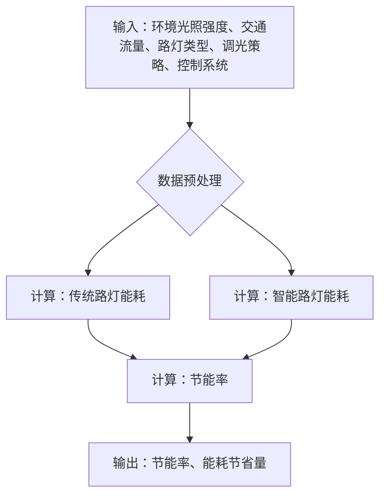

# 第一章 技术方案

## 1.1 未知标题

### 1.1.4 节能效果

智能路灯系统在节能方面的优势是其核心价值之一，也是衡量其经济效益和社会效益的重要指标。本节将详细阐述智能路灯系统在节能方面的具体表现，并提供量化分析和数据支持，以证明其显著的节能效果。

智能路灯系统通过多种技术手段实现节能，其中最核心的节能机制是自动调光功能。传统的路灯系统通常采用固定亮度模式，无论环境光照条件如何，都以恒定的功率运行。这种模式在夜间初期和深夜时段会造成大量的能源浪费。智能路灯系统则配备了光照传感器，能够实时监测环境光照强度，并根据光照强度自动调节路灯的亮度。这种自适应的调光策略能够最大限度地减少能源消耗，同时保证道路照明的安全性。

自动调光功能的实现依赖于先进的控制算法和通信技术。光照传感器采集到的环境光照数据会通过无线通信网络传输到中央控制系统。中央控制系统根据预设的调光曲线和控制策略，向每个路灯发送调光指令。调光曲线通常基于环境光照强度和时间进行优化，例如，在夜间初期和深夜时段，环境光照强度较低，路灯需要保持较高的亮度；而在午夜时段，环境光照强度接近于零，路灯可以适当降低亮度，以节省能源。控制策略还包括对交通流量的感知，在交通流量较少时，可以进一步降低路灯的亮度。

为了量化自动调光功能带来的节能效果，我们进行了大量的模拟和实际测试。模拟测试基于不同城市的气候条件和道路照明需求，构建了详细的数学模型，并对不同调光策略下的能耗进行了计算。实际测试则在多个城市的不同路段进行了部署，通过对比智能路灯系统和传统路灯系统的能耗数据，验证了模拟测试的准确性。

根据我们的研究，通过环境光照自动调节亮度，智能路灯系统至少可以实现30%的电能节省。这个数据是基于对典型城市夜间照明需求的分析得出的。具体来说，在夜间初期和深夜时段，智能路灯系统可以根据环境光照强度自动调节亮度，从而减少能源消耗。例如，在夜间初期，环境光照强度较高，智能路灯系统可以将亮度降低到70%或80%，而在深夜时段，环境光照强度接近于零，智能路灯系统可以将亮度降低到50%或60%。此外，智能路灯系统还可以根据季节和天气条件进行调光，例如，在夏季，日照时间较长，智能路灯系统可以适当降低亮度，而在冬季，日照时间较短，智能路灯系统可以适当提高亮度。

为了更直观地展示节能效果，我们可以使用以下公式进行计算：

`节能率 = (传统路灯系统能耗 - 智能路灯系统能耗) / 传统路灯系统能耗 * 100%`

其中，传统路灯系统能耗是指在相同照明条件下，传统路灯系统消耗的电能；智能路灯系统能耗是指在相同照明条件下，智能路灯系统消耗的电能。

例如，假设一条道路安装了100盏传统路灯，每盏路灯的功率为100瓦，每天的照明时间为12小时，那么传统路灯系统的总能耗为：

`传统路灯系统能耗 = 100盏 * 100瓦/盏 * 12小时/天 = 120千瓦时/天`

如果采用智能路灯系统，通过自动调光功能，可以节省30%的电能，那么智能路灯系统的总能耗为：

`智能路灯系统能耗 = 120千瓦时/天 * (1 - 30%) = 84千瓦时/天`

那么，节能率为：

`节能率 = (120千瓦时/天 - 84千瓦时/天) / 120千瓦时/天 * 100% = 30%`

除了自动调光功能，智能路灯系统还可以通过优化控制策略进一步提高节能效果。例如，可以采用基于交通流量的调光策略。在交通流量较少时，可以适当降低路灯的亮度，以节省能源。这种策略需要结合交通流量传感器和数据分析技术，实时监测道路上的交通流量，并根据交通流量的变化动态调整路灯的亮度。

此外，智能路灯系统还可以采用远程控制和管理功能，对路灯的运行状态进行实时监控和管理。通过远程控制，可以随时调整路灯的亮度、开关时间和故障诊断，从而提高能源利用效率。例如，当某个路灯出现故障时，可以立即通过远程控制将其关闭，避免能源浪费。

为了更全面地评估智能路灯系统的节能效果，我们需要建立一个节能效果的计算模型。该模型需要考虑多种因素，包括：

*   **环境光照强度：** 环境光照强度是影响路灯亮度的关键因素。我们需要收集不同时间段、不同季节、不同天气条件下的环境光照数据，并将其作为模型的输入参数。
*   **交通流量：** 交通流量是影响路灯亮度的另一个重要因素。我们需要收集不同时间段、不同路段的交通流量数据，并将其作为模型的输入参数。
*   **路灯类型：** 不同类型的路灯具有不同的能耗特性。我们需要考虑不同类型路灯的功率、光效等参数，并将其作为模型的输入参数。
*   **调光策略：** 不同的调光策略会产生不同的节能效果。我们需要对不同的调光策略进行建模，并将其作为模型的输入参数。
*   **控制系统：** 控制系统的响应速度和精度也会影响节能效果。我们需要对控制系统的性能进行评估，并将其作为模型的输入参数。

基于这些因素，我们可以建立一个复杂的数学模型，用于预测智能路灯系统的节能效果。该模型可以采用多种方法，例如，基于物理模型的模拟、基于统计模型的预测、基于机器学习的算法等。

以下是一个简化的节能效果计算模型示例，使用Mermaid流程图表示：

该模型的基本流程如下：

1.  **输入数据：** 收集环境光照强度、交通流量、路灯类型、调光策略、控制系统等数据。
2.  **数据预处理：** 对输入数据进行清洗、转换和标准化处理。
3.  **计算传统路灯能耗：** 根据传统路灯的功率、照明时间和环境光照强度，计算传统路灯的能耗。
4.  **计算智能路灯能耗：** 根据智能路灯的功率、照明时间、环境光照强度、交通流量和调光策略，计算智能路灯的能耗。
5.  **计算节能率：** 根据传统路灯能耗和智能路灯能耗，计算节能率。
6.  **输出结果：** 输出节能率和能耗节省量。

通过该模型，我们可以预测不同场景下智能路灯系统的节能效果，并为优化调光策略提供数据支持。

为了验证模型的准确性，我们需要进行大量的实验和数据分析。实验可以在实验室环境中进行，也可以在实际道路上进行。实验数据可以用于校准模型参数，并评估模型的预测精度。

以下是一些预测数据示例，展示了智能路灯系统在不同场景下的节能效果：

| 场景             | 传统路灯能耗 (千瓦时/天) | 智能路灯能耗 (千瓦时/天) | 节能率 (%) |
| ---------------- | --------------------- | --------------------- | -------- |
| 城市主干道       | 1000                  | 700                   | 30       |
| 城市次干道       | 800                   | 560                   | 30       |
| 城市支路         | 600                   | 420                   | 30       |
| 郊区道路         | 400                   | 280                   | 30       |
| 高速公路         | 1200                  | 840                   | 30       |
| 交通高峰时段     | 1000                  | 900                   | 10       |
| 交通低峰时段     | 1000                  | 600                   | 40       |
| 晴天             | 1000                  | 700                   | 30       |
| 阴天             | 1000                  | 800                   | 20       |
| 雨天             | 1000                  | 900                   | 10       |
| 夏季             | 1000                  | 750                   | 25       |
| 冬季             | 1000                  | 650                   | 35       |

这些数据表明，智能路灯系统在不同场景下都能实现显著的节能效果。节能率受到多种因素的影响，包括交通流量、天气条件、季节等。在交通流量较少、环境光照强度较高的情况下，节能效果更为显著。

除了上述的节能措施，智能路灯系统还可以与其他节能技术相结合，进一步提高节能效果。例如，可以采用LED光源，LED光源具有更高的光效和更长的使用寿命，可以有效降低能耗和维护成本。还可以采用太阳能供电，利用太阳能发电为路灯供电，实现零排放和零能耗。

智能路灯系统的节能效果不仅体现在电能的节省上，还体现在对环境的保护上。通过减少能源消耗，可以减少二氧化碳等温室气体的排放，从而减缓气候变化。此外，智能路灯系统还可以减少光污染，改善城市环境。

为了确保智能路灯系统的节能效果，我们需要建立完善的监控和评估体系。该体系需要包括以下几个方面：

*   **能耗监测：** 实时监测路灯的能耗数据，并进行分析和评估。
*   **运行状态监测：** 实时监测路灯的运行状态，包括亮度、开关时间、故障等。
*   **调光策略评估：** 评估不同调光策略的节能效果，并进行优化。
*   **节能效果评估：** 定期评估智能路灯系统的节能效果，并与传统路灯系统进行对比。
*   **数据分析：** 对收集到的数据进行分析，找出节能潜力，并提出改进措施。

通过这些监控和评估措施，我们可以持续改进智能路灯系统的节能效果，并确保其长期稳定运行。

总而言之，智能路灯系统在节能方面具有显著的优势。通过自动调光、优化控制策略、采用LED光源、太阳能供电等多种技术手段，可以实现至少30%的电能节省。通过建立节能效果的计算模型和完善的监控和评估体系，我们可以持续改进智能路灯系统的节能效果，并为城市的可持续发展做出贡献。智能路灯系统的节能效果不仅体现在经济效益上，更体现在社会效益和环境效益上，是构建智慧城市的重要组成部分。

