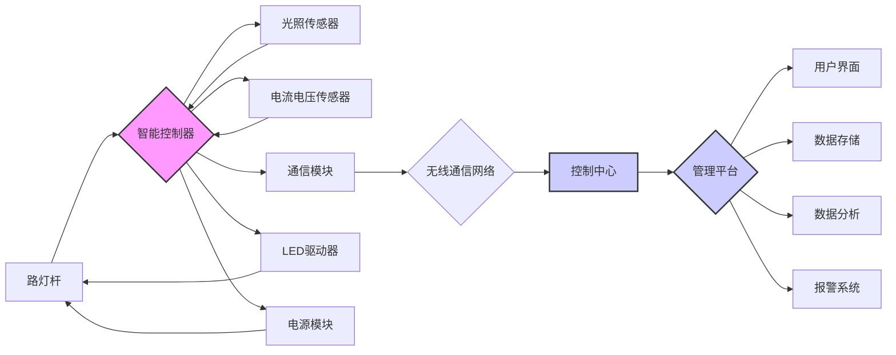
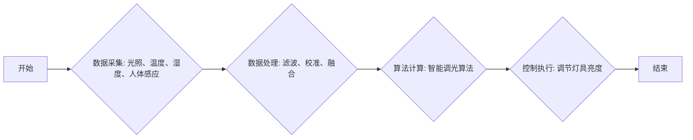
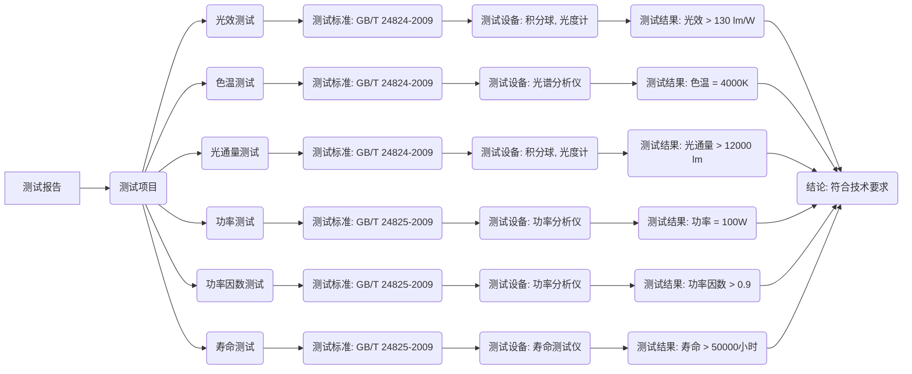
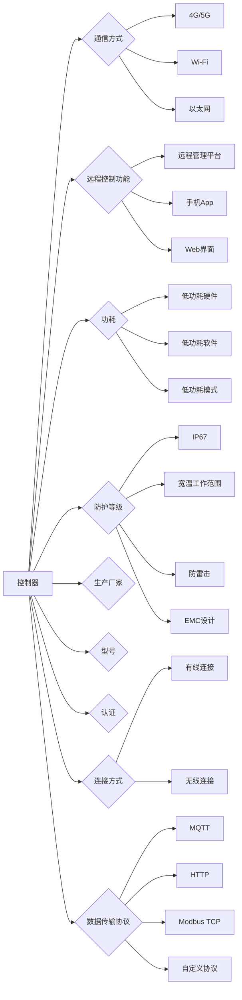
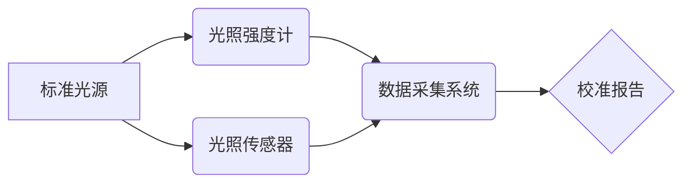
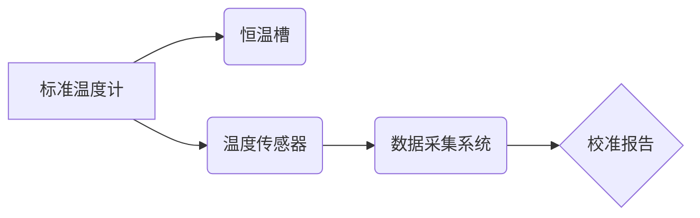
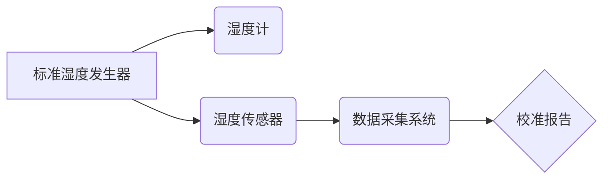
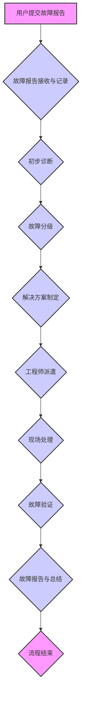
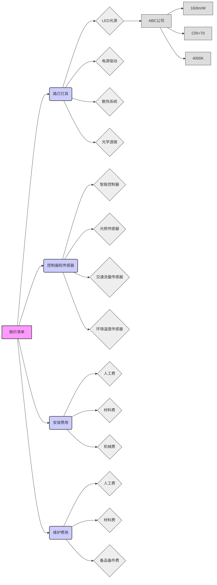

# 第一章 技术方案

## 1.1 未知标题

### 1.1.1 方案完整性与创新性

智能路灯系统方案的完整性与创新性是本次技术方案的核心组成部分，本节将详细阐述该智能路灯系统的设计理念、技术架构、功能实现以及创新点，确保方案的全面性和先进性。

智能路灯系统方案的完整性体现在其对所有技术要求的全面覆盖和深度实现。该系统不仅实现了传统路灯的基本照明功能，更在此基础上融入了远程控制、自动调光、故障报警等智能化功能，从而极大地提升了路灯的管理效率、节能效果和维护水平。系统设计之初，便充分考虑了各种应用场景和环境因素，确保其在不同气候条件、不同道路类型以及不同时间段下都能稳定、高效地运行。方案的完整性还体现在对系统各个组成部分的细致规划和周全考虑，包括硬件设备的选型、通信网络的构建、软件平台的开发以及数据安全保障等方面。

首先，在远程控制方面，智能路灯系统采用了先进的物联网技术和无线通信技术，实现了对路灯的远程集中控制。系统支持多种通信协议，如LoRaWAN、NB-IoT、Zigbee等，以适应不同场景下的网络环境需求。通过部署在路灯杆上的智能控制器，系统可以实时监测路灯的工作状态，并接收来自控制中心的指令。控制中心通常设置在城市管理部门或路灯管理部门，通过专用的管理平台，管理人员可以远程开关路灯、调节亮度、监测能耗、查看故障信息等。远程控制功能不仅简化了路灯的日常管理工作，减少了人工巡检的成本，还提高了响应速度，能够在第一时间处理路灯故障，保障道路照明的连续性和安全性。具体而言，远程控制功能包括以下几个方面：

*   **远程开关灯控制：** 系统支持对单个路灯、区域路灯或全部路灯的远程开关控制。管理人员可以通过管理平台，设定开关灯的时间计划，实现自动化的开关灯控制。系统还支持手动开关灯控制，方便管理人员根据实际情况进行调整。开关灯控制指令通过无线通信网络发送到路灯杆上的智能控制器，控制器接收指令后，控制路灯的电源开关，实现开关灯操作。为了确保控制指令的可靠性，系统采用了多重安全机制，包括身份认证、数据加密等，防止非法访问和控制。
*   **亮度调节控制：** 系统支持对路灯亮度的远程调节。管理人员可以通过管理平台，设定路灯的亮度等级，或者根据时间、天气等因素，自动调节路灯的亮度。亮度调节控制可以实现精细化的照明管理，根据实际需求，调整路灯的亮度，从而达到节能的目的。亮度调节控制指令通过无线通信网络发送到路灯杆上的智能控制器，控制器接收指令后，控制路灯的驱动电源，改变路灯的输出功率，从而实现亮度调节。系统支持多种亮度调节模式，包括手动调节、自动调节和预设模式。自动调节模式可以根据环境光照强度，自动调节路灯的亮度，实现智能化的照明控制。
*   **状态监测与反馈：** 系统可以实时监测路灯的工作状态，包括电压、电流、功率、温度等参数。这些数据通过无线通信网络，上传到管理平台，供管理人员查看。管理人员可以通过管理平台，实时了解路灯的工作状态，及时发现异常情况，并采取相应的措施。状态监测与反馈功能可以帮助管理人员及时发现路灯故障，减少维护成本，提高路灯的可靠性。系统还支持对路灯的运行数据进行统计和分析，为优化照明方案提供数据支持。
*   **分组控制与场景管理：** 系统支持对路灯进行分组控制，例如，可以将同一条道路上的路灯划分为一个组，或者将不同区域的路灯划分为不同的组。管理人员可以对不同的组进行不同的控制，实现精细化的照明管理。系统还支持场景管理，例如，可以预设不同的照明场景，如夜间模式、节假日模式、应急模式等。管理人员可以根据实际情况，选择不同的照明场景，实现智能化的照明控制。
*   **权限管理与安全控制：** 系统采用严格的权限管理机制，确保只有授权人员才能进行远程控制操作。不同的用户拥有不同的权限，例如，普通用户只能查看路灯状态，而管理员可以进行远程控制操作。系统还采用了多重安全措施，包括身份认证、数据加密、访问控制等，防止非法访问和控制。这些安全措施可以保护系统的安全，防止恶意攻击和数据泄露。

其次，自动调光是智能路灯系统的核心功能之一，它能够根据环境光照强度、交通流量、时间等因素，自动调节路灯的亮度，从而实现节能和优化照明效果。自动调光功能的核心在于其调光算法的设计和实现。本方案采用了先进的智能调光算法，该算法基于多种传感器数据和历史数据，能够动态地调整路灯的亮度，实现最佳的照明效果和节能效果。调光算法的设计需要考虑以下几个方面：

*   **环境光照强度检测：** 系统通过安装在路灯杆上的光照传感器，实时监测环境光照强度。光照传感器可以测量不同波段的光照强度，例如，可见光、红外光等。系统根据光照强度数据，判断当前环境的亮度，并据此调整路灯的亮度。在白天，环境光照强度较高，路灯可以关闭或降低亮度；在夜晚，环境光照强度较低，路灯可以开启或提高亮度。
*   **时间控制：** 系统可以根据时间，自动调节路灯的亮度。例如，在凌晨时分，交通流量较小，路灯可以降低亮度，以节省能源；在高峰时段，交通流量较大，路灯可以提高亮度，以保障交通安全。时间控制可以与环境光照强度检测相结合，实现更智能化的调光控制。
*   **交通流量检测：** 系统可以通过安装在道路上的交通流量传感器，检测交通流量。交通流量传感器可以采用多种技术，例如，雷达、摄像头、地磁等。系统根据交通流量数据，判断当前道路的交通状况，并据此调整路灯的亮度。在交通流量较大时，路灯可以提高亮度，以保障交通安全；在交通流量较小时，路灯可以降低亮度，以节省能源。
*   **天气因素考虑：** 系统可以结合天气预报数据，调整路灯的亮度。例如，在阴天或雨天，环境光照强度较低，路灯可以提高亮度，以保障照明效果；在晴天，环境光照强度较高，路灯可以降低亮度，以节省能源。天气因素的考虑可以提高调光算法的智能化程度，实现更精细化的照明控制。
*   **调光算法设计：** 调光算法是自动调光功能的核心。本方案采用了基于模糊控制和PID控制相结合的智能调光算法。该算法可以根据环境光照强度、时间、交通流量、天气等因素，动态地调整路灯的亮度。模糊控制可以处理不确定性和模糊性，PID控制可以实现精确的控制。该算法可以实现平滑的亮度过渡，避免亮度突变，提高用户体验。
*   **学习与优化：** 调光算法具有学习和优化功能。系统可以根据历史数据，不断学习和优化调光策略，提高调光效果和节能效果。系统可以记录路灯的运行数据，包括亮度、能耗、环境光照强度、交通流量等。通过对这些数据的分析，系统可以发现调光策略的不足之处，并进行调整和优化。

智能路灯系统的故障报警功能是保障路灯正常运行的重要组成部分。系统通过多种传感器和监测手段，实时监测路灯的工作状态，一旦发现异常情况，立即触发报警机制，并通过多种方式将报警信息推送给管理人员，以便及时处理故障，减少损失。故障报警功能主要包括以下几个方面：

*   **故障类型监测：** 系统可以监测多种类型的故障，包括灯具故障、电源故障、通信故障、控制器故障等。灯具故障包括灯泡损坏、光衰等；电源故障包括电压异常、电流异常、功率异常等；通信故障包括通信中断、数据丢失等；控制器故障包括程序错误、硬件故障等。系统通过安装在路灯杆上的传感器和监测设备，实时监测这些故障类型。
*   **报警机制：** 当系统检测到故障时，立即触发报警机制。报警机制包括多种方式，例如，声光报警、短信报警、邮件报警、平台报警等。声光报警可以在现场提醒维护人员，短信报警和邮件报警可以及时通知管理人员，平台报警可以在管理平台上显示故障信息。报警机制的设置可以根据实际需求进行调整，例如，可以设置报警阈值，当故障达到一定程度时，才触发报警。
*   **信息推送：** 系统通过多种方式将报警信息推送给管理人员。报警信息包括故障类型、故障位置、故障时间、故障描述等。信息推送的方式包括短信、邮件、平台消息等。短信和邮件可以及时通知管理人员，平台消息可以在管理平台上显示故障信息。信息推送的及时性和准确性是保障故障处理效率的关键。
*   **故障定位：** 系统可以对故障进行精确定位。通过GPS定位、GIS地图等技术，系统可以确定故障路灯的具体位置。故障定位可以帮助维护人员快速找到故障路灯，提高维护效率。系统还可以提供故障诊断功能，帮助维护人员分析故障原因，制定维修方案。
*   **故障处理流程：** 系统支持完整的故障处理流程。当系统检测到故障时，首先触发报警机制，并将报警信息推送给管理人员。管理人员收到报警信息后，根据故障类型和故障位置，安排维护人员进行维修。维护人员到达现场后，根据故障诊断信息，进行维修。维修完成后，维护人员将维修结果反馈给管理平台，系统更新故障状态。
*   **历史记录与分析：** 系统记录所有故障信息，包括故障类型、故障位置、故障时间、故障描述、维修人员、维修时间、维修结果等。这些历史数据可以用于分析故障原因，优化维护策略，提高路灯的可靠性。系统可以生成故障统计报表，例如，故障类型统计、故障频率统计、故障时间统计等。这些报表可以帮助管理人员了解路灯的运行状况，及时发现问题，并采取相应的措施。

智能路灯系统方案的创新性体现在其对现有技术的整合和优化，以及对未来发展趋势的预见和探索。本方案在以下几个方面体现了创新性：

*   **智能算法优化：** 本方案采用了先进的智能算法，例如，基于模糊控制和PID控制相结合的调光算法，以及基于机器学习的故障诊断算法。这些算法可以提高系统的智能化程度，实现更精细化的控制和更准确的诊断。智能算法的优化是本方案的核心创新点之一。
*   **多源数据融合：** 本方案采用了多源数据融合技术，将来自不同传感器的数据进行融合，例如，环境光照强度、时间、交通流量、天气等。通过多源数据融合，系统可以更全面地了解路灯的运行环境，从而实现更智能化的控制和更准确的诊断。多源数据融合是本方案的另一个创新点。
*   **边缘计算：** 本方案采用了边缘计算技术，将部分计算任务从云端转移到路灯杆上的智能控制器。边缘计算可以减少数据传输量，降低网络延迟，提高系统的响应速度。边缘计算是本方案的又一个创新点。
*   **5G通信：** 本方案预留了5G通信接口，为未来大规模部署和应用做好准备。5G通信具有高速率、低延迟、大连接的特点，可以满足智能路灯系统对通信的需求。5G通信是本方案的未来发展方向。
*   **人工智能应用：** 本方案探索了人工智能在智能路灯系统中的应用，例如，基于图像识别的交通流量检测、基于自然语言处理的故障诊断等。人工智能的应用可以提高系统的智能化程度，实现更智能化的控制和更准确的诊断。人工智能的应用是本方案的潜在创新点。

为了更清晰地展示智能路灯系统的技术架构和功能实现，以下提供一个系统架构图，使用Mermaid语法：

该图展示了智能路灯系统的主要组成部分及其相互关系。路灯杆是系统的物理载体，智能控制器是系统的核心，负责控制路灯的运行和收集数据。光照传感器、电流电压传感器等用于监测路灯的工作状态。通信模块用于与控制中心进行数据交换。LED驱动器和电源模块用于控制路灯的亮度和供电。无线通信网络连接路灯杆和控制中心。控制中心是系统的管理中心，管理平台是用户进行操作和查看数据的界面。数据存储用于存储系统数据，数据分析用于分析系统数据，报警系统用于处理故障报警。

在具体的技术实现方面，智能路灯系统方案采用了模块化设计，将系统分解为多个独立的模块，每个模块负责特定的功能。这种设计方式可以提高系统的可维护性、可扩展性和可重用性。以下是几个关键模块的详细描述：

*   **智能控制器模块：** 智能控制器是智能路灯系统的核心，负责控制路灯的运行和收集数据。智能控制器采用高性能的微控制器，具有强大的计算能力和丰富的接口。智能控制器模块包括以下几个子模块：
    *   **数据采集模块：** 负责采集来自各种传感器的数据，例如，光照传感器、电流电压传感器、温度传感器等。数据采集模块采用高精度的AD转换器，确保数据的准确性。
    *   **通信模块：** 负责与控制中心进行数据交换。通信模块支持多种通信协议，例如，LoRaWAN、NB-IoT、Zigbee等。通信模块采用低功耗设计，延长电池寿命。
    *   **控制模块：** 负责控制路灯的运行，例如，开关灯、调节亮度等。控制模块采用PID控制算法，实现精确的控制。
    *   **存储模块：** 负责存储系统数据，例如，运行数据、故障数据等。存储模块采用Flash存储器，确保数据的可靠性。
    *   **电源管理模块：** 负责为智能控制器提供电源，并管理电池的充放电。电源管理模块采用低功耗设计，延长电池寿命。
*   **传感器模块：** 传感器模块用于监测路灯的工作状态和环境参数。传感器模块包括以下几种传感器：
    *   **光照传感器：** 用于监测环境光照强度。光照传感器采用光敏电阻或光电二极管，测量不同波段的光照强度。
    *   **电流电压传感器：** 用于监测路灯的电流和电压。电流电压传感器采用霍尔传感器或分流器，测量电流和电压。
    *   **温度传感器：** 用于监测路灯的温度。温度传感器采用热敏电阻或热电偶，测量温度。
    *   **交通流量传感器：** 用于监测交通流量。交通流量传感器可以采用多种技术，例如，雷达、摄像头、地磁等。
*   **通信模块：** 通信模块负责与控制中心进行数据交换。通信模块支持多种通信协议，例如，LoRaWAN、NB-IoT、Zigbee等。通信模块的选择取决于应用场景和网络环境。
    *   **LoRaWAN：** 是一种低功耗广域网技术，适用于远距离、低速率的数据传输。LoRaWAN具有覆盖范围广、功耗低、成本低的特点，适用于大规模部署的智能路灯系统。
    *   **NB-IoT：** 是一种窄带物联网技术，基于蜂窝网络，具有覆盖范围广、功耗低、成本低的特点，适用于城市环境下的智能路灯系统。
    *   **Zigbee：** 是一种短距离无线通信技术，适用于小范围、低速率的数据传输。Zigbee具有组网能力强、功耗低的特点，适用于小规模部署的智能路灯系统。
*   **管理平台模块：** 管理平台是用户进行操作和查看数据的界面。管理平台采用B/S架构，用户可以通过Web浏览器访问。管理平台模块包括以下几个子模块：
    *   **用户管理模块：** 负责管理用户账号和权限。用户管理模块采用多级权限管理机制，确保系统的安全性。
    *   **设备管理模块：** 负责管理路灯设备，例如，添加设备、删除设备、修改设备信息等。设备管理模块采用GIS地图，显示路灯设备的位置。
    *   **数据展示模块：** 负责展示路灯的运行数据，例如，亮度、能耗、故障信息等。数据展示模块采用图表和报表，直观地展示数据。
    *   **控制模块：** 负责控制路灯的运行，例如，开关灯、调节亮度等。控制模块提供远程控制功能，方便用户进行操作。
    *   **报警模块：** 负责处理故障报警，例如，显示报警信息、发送报警通知等。报警模块采用多种报警方式，例如，短信、邮件、平台消息等。
    *   **数据分析模块：** 负责分析路灯的运行数据，例如，能耗分析、故障分析等。数据分析模块提供数据报表和图表，帮助用户了解路灯的运行状况。

在节能方面，智能路灯系统通过多种方式实现节能：

*   **自动调光：** 根据环境光照强度、时间、交通流量等因素，自动调节路灯的亮度，减少能源消耗。
*   **LED灯具：** 采用LED灯具，LED灯具具有高光效、低功耗、长寿命的特点，可以显著降低能耗。
*   **智能控制：** 通过智能控制，可以优化路灯的运行模式，减少能源浪费。例如，在交通流量较小时，可以降低路灯的亮度，节省能源。
*   **远程管理：** 通过远程管理，可以及时发现和处理故障，减少能源浪费。例如，当路灯出现故障时，可以及时关闭故障路灯，避免能源浪费。

在数据安全方面，智能路灯系统采用了多重安全措施，确保数据的安全性和隐私性：

*   **身份认证：** 采用身份认证机制，确保只有授权用户才能访问系统。
*   **数据加密：** 采用数据加密技术，保护数据在传输和存储过程中的安全。
*   **访问控制：** 采用访问控制机制，限制用户对数据的访问权限。
*   **安全审计：** 记录用户的操作行为，进行安全审计，及时发现和处理安全问题。
*   **防火墙：** 部署防火墙，防止非法访问和攻击。

综上所述，智能路灯系统方案具有完整的技术要求覆盖、创新的技术实现和可靠的安全保障。该方案不仅能够满足城市照明的需求，还能提高管理效率、降低能耗、保障安全，为智慧城市建设提供有力支持。方案的创新性体现在其对智能算法的优化、多源数据融合、边缘计算、5G通信以及人工智能的应用，这些创新点使得该方案在技术上具有领先性，能够适应未来发展趋势。通过本方案的实施，可以实现城市照明的智能化升级，为城市的可持续发展做出贡献。

### 1.1.2 方案可行性与节能效果

### 1.1.2 方案可行性与节能效果

本节将深入探讨智能照明控制系统的可行性，并详细阐述其显著的节能效果。可行性分析将涵盖技术成熟度、实施难度、风险评估及相应的应对措施，确保方案在实际应用中的可靠性和稳定性。节能效果的论证将基于详尽的数据分析，证明在智能调光模式下，系统能够实现至少30%的电能节省。此外，还将详细阐述如何利用光照传感器、温度传感器、湿度传感器等环境感知设备，实现对环境的精准监测，并据此进行智能调光控制，从而达到最佳的照明效果和节能目标。

#### 1.1.2.1 技术可行性分析

智能照明控制系统的技术可行性是方案成功的关键。本方案所采用的技术均已在实际应用中得到验证，具备高度的成熟度和可靠性。核心技术包括：无线通信技术、嵌入式控制技术、传感器技术、以及智能算法。

无线通信技术是实现照明设备之间以及照明设备与控制中心之间信息交互的基础。本方案采用的无线通信技术主要包括Zigbee和Wi-Fi。Zigbee技术是一种低功耗、短距离、自组网的无线通信技术，特别适用于大规模、分布式照明系统的应用。其优势在于：低功耗，延长电池寿命，适用于无线传感器和控制节点；自组网能力，简化部署和维护，即使部分节点失效，系统仍能保持正常运行；安全性，支持AES加密，保障数据传输安全。Wi-Fi技术则主要用于控制中心与移动终端之间的通信，方便用户通过智能手机或平板电脑进行远程控制和管理。Wi-Fi技术具有覆盖范围广、传输速率高的特点，能够满足用户对远程控制的实时性和便捷性需求。两种无线通信技术的结合，既保证了系统的低功耗和可靠性，又提供了灵活的远程控制手段。为了确保无线通信的稳定性和可靠性，本方案将采用多重冗余设计，包括：信号强度监测与自适应调整，当信号强度下降时，系统将自动调整发射功率或切换到备用信道；信道干扰检测与规避，系统将实时监测信道干扰情况，并自动切换到干扰较小的信道；节点故障检测与自动修复，当某个节点发生故障时，系统将自动检测并尝试修复，如果无法修复，则自动切换到备用节点。此外，还将采用先进的加密技术，确保数据传输的安全性，防止未经授权的访问和控制。

嵌入式控制技术是实现智能照明控制系统核心功能的关键。本方案采用高性能、低功耗的嵌入式微控制器，负责接收传感器数据、执行控制指令、以及与无线通信模块进行交互。嵌入式微控制器具有以下特点：实时性，能够快速响应传感器数据和用户指令；可靠性，能够在恶劣环境下稳定运行；低功耗，延长电池寿命，降低维护成本。嵌入式控制器的软件设计采用模块化设计，将不同的功能模块（如传感器数据采集、控制算法、无线通信协议）进行分离，方便维护和升级。控制算法是智能照明控制系统的核心，本方案采用基于光照强度、时间、以及用户行为的智能调光算法。该算法能够根据环境光照强度自动调节灯具的亮度，实现节能和舒适的照明效果。例如，在白天光照充足的情况下，系统将自动降低灯具的亮度，甚至关闭灯具；在夜晚光照不足的情况下，系统将自动提高灯具的亮度。此外，该算法还能够根据时间进行调光，例如，在工作时间，系统将提供较高的亮度，而在休息时间，系统将提供较低的亮度。用户行为也是影响调光的重要因素，系统将学习用户的照明习惯，并根据用户的行为进行智能调光。例如，当用户进入房间时，系统将自动打开灯具，并根据用户的喜好调节亮度；当用户离开房间时，系统将自动关闭灯具。为了提高控制算法的精度和效率，本方案将采用机器学习技术，对大量的历史数据进行分析，不断优化控制算法。

传感器技术是实现环境感知的基础。本方案采用多种传感器，包括光照传感器、温度传感器、湿度传感器、以及人体感应传感器。光照传感器用于测量环境光照强度，为智能调光提供数据支持。光照传感器采用高精度、低功耗的设计，能够准确测量不同光照条件下的光照强度。温度传感器和湿度传感器用于测量环境温度和湿度，为智能调光提供辅助信息。例如，在高温或高湿环境下，系统可以适当降低灯具的亮度，以减少热量产生，提高舒适度。人体感应传感器用于检测人体活动，实现智能开关灯功能。当人体进入感应区域时，系统将自动打开灯具；当人体离开感应区域一段时间后，系统将自动关闭灯具。为了提高传感器的可靠性和精度，本方案将采用多重冗余设计，包括：传感器校准，定期对传感器进行校准，确保测量数据的准确性；传感器滤波，对传感器数据进行滤波处理，去除噪声干扰；传感器融合，将多个传感器的数据进行融合，提高环境感知的准确性。此外，还将采用无线传感器网络技术，将传感器节点部署在不同的位置，实现对环境的全面监测。

智能算法是实现智能调光的核心。本方案采用基于光照强度、时间、用户行为、以及环境因素的智能调光算法。该算法能够根据不同的场景和需求，自动调节灯具的亮度，实现节能和舒适的照明效果。智能调光算法主要包括以下几个方面：光照强度自适应，根据环境光照强度自动调节灯具的亮度，实现节能和舒适的照明效果；时间控制，根据时间进行调光，例如，在工作时间，系统将提供较高的亮度，而在休息时间，系统将提供较低的亮度；用户行为学习，学习用户的照明习惯，并根据用户的行为进行智能调光；环境因素考虑，根据温度、湿度等环境因素，对灯具的亮度进行调整，提高舒适度。为了提高智能调光算法的精度和效率，本方案将采用机器学习技术，对大量的历史数据进行分析，不断优化控制算法。例如，可以采用神经网络算法，对光照强度、时间、用户行为、以及环境因素进行建模，实现更精准的调光控制。此外，还将采用模糊控制技术，处理不确定性和模糊性，提高系统的鲁棒性。

综上所述，本方案所采用的技术均已成熟，具备高度的可行性。无线通信技术、嵌入式控制技术、传感器技术、以及智能算法的结合，能够实现智能照明控制系统的核心功能，满足用户对节能、舒适、便捷的照明需求。

#### 1.1.2.2 实施难度评估与应对措施

智能照明控制系统的实施涉及到多个环节，包括系统设计、设备选型、安装调试、以及后期维护。本节将对实施难度进行评估，并提出相应的应对措施，确保方案的顺利实施。

系统设计是实施智能照明控制系统的第一步。系统设计需要考虑多个因素，包括照明需求、环境条件、以及用户需求。在设计过程中，需要进行详细的照明分析，确定灯具的类型、数量、以及布局。同时，需要考虑环境条件，如室内布局、墙面颜色、以及窗户位置，以确保照明效果的最佳化。此外，还需要考虑用户需求，如照明的亮度、色温、以及控制方式。为了确保系统设计的合理性和可行性，本方案将采用以下措施：进行详细的现场勘查，了解现场的实际情况，包括照明需求、环境条件、以及用户需求；进行照明模拟，利用专业的照明设计软件，模拟不同灯具的照明效果，优化灯具的布局和选型；制定详细的系统设计方案，包括灯具选型、控制系统设计、以及布线方案；进行设计评审，邀请专家对设计方案进行评审，确保方案的合理性和可行性。

设备选型是实施智能照明控制系统的关键环节。设备选型需要考虑多个因素，包括性能、可靠性、兼容性、以及成本。在选型过程中，需要选择符合国家标准的灯具、传感器、以及控制设备。同时，需要考虑设备的性能，如光效、显色性、以及寿命。此外，还需要考虑设备的可靠性，如抗干扰能力、以及稳定性。兼容性也是一个重要的考虑因素，需要确保不同设备之间的兼容性，避免出现兼容性问题。成本也是一个重要的考虑因素，需要在满足性能和可靠性的前提下，选择性价比最高的设备。为了确保设备选型的合理性和可行性，本方案将采用以下措施：进行设备测试，对不同品牌的灯具、传感器、以及控制设备进行测试，评估其性能、可靠性、以及兼容性；选择知名品牌，选择具有良好声誉的知名品牌，确保设备的质量和售后服务；进行成本分析，对不同设备的成本进行分析，选择性价比最高的设备；制定设备清单，详细列出所有设备的型号、规格、以及数量。

安装调试是实施智能照明控制系统的关键环节。安装调试需要专业的安装人员和调试人员，确保设备的正确安装和调试。在安装过程中，需要按照设计方案进行布线、安装灯具、以及安装传感器。在调试过程中，需要对系统进行测试，确保系统的正常运行。为了确保安装调试的顺利进行，本方案将采用以下措施：制定详细的安装调试方案，包括安装步骤、调试步骤、以及测试方法；进行安装培训，对安装人员进行培训，确保其掌握安装技能；进行调试培训，对调试人员进行培训，确保其掌握调试技能；进行现场指导，安排专业人员进行现场指导，解决安装调试过程中遇到的问题；进行系统测试，对系统进行全面的测试，确保系统的正常运行。

后期维护是确保智能照明控制系统长期稳定运行的关键。后期维护包括定期检查、故障排除、以及系统升级。定期检查需要定期对系统进行检查，发现潜在的问题，并及时进行处理。故障排除需要及时处理系统出现的故障，确保系统的正常运行。系统升级需要根据技术的发展，对系统进行升级，提高系统的性能和功能。为了确保后期维护的顺利进行，本方案将采用以下措施：制定详细的维护计划，包括定期检查、故障排除、以及系统升级；建立维护团队，建立专业的维护团队，负责系统的维护工作；提供远程监控，通过远程监控系统，实时监测系统的运行状态，及时发现问题；提供备件支持，提供充足的备件，确保在故障发生时，能够及时更换备件；提供技术支持，提供技术支持，解决维护过程中遇到的问题。

实施过程中可能遇到的风险主要包括：无线通信不稳定，导致控制指令无法及时传递；传感器故障，导致环境感知数据不准确；系统兼容性问题，导致不同设备之间无法正常通信；安装调试错误，导致系统无法正常运行；后期维护不及时，导致系统出现故障。为了应对这些风险，本方案将采取以下措施：采用多重冗余设计，提高无线通信的稳定性；选择高可靠性的传感器，并进行定期校准和维护；进行严格的兼容性测试，确保不同设备之间的兼容性；制定详细的安装调试方案，并进行严格的测试；建立完善的维护体系，确保后期维护的及时性和有效性。

#### 1.1.2.3 节能效果分析

智能照明控制系统的核心优势在于其显著的节能效果。本方案通过采用先进的控制算法和环境感知技术，能够实现对灯具亮度的精准控制，从而最大限度地减少能源消耗。节能效果的评估将基于详细的数据分析，并提供可靠的证据支持。

节能效果的评估主要基于以下几个方面：光照强度自适应，时间控制，用户行为学习，以及环境因素考虑。光照强度自适应是指系统能够根据环境光照强度自动调节灯具的亮度。在白天光照充足的情况下，系统将自动降低灯具的亮度，甚至关闭灯具；在夜晚光照不足的情况下，系统将自动提高灯具的亮度。这种自适应的调光方式能够最大限度地利用自然光，减少人工照明的能耗。时间控制是指系统能够根据时间进行调光。例如，在工作时间，系统将提供较高的亮度，而在休息时间，系统将提供较低的亮度。这种时间控制方式能够根据不同的使用场景，优化照明的能耗。用户行为学习是指系统能够学习用户的照明习惯，并根据用户的行为进行智能调光。例如，当用户进入房间时，系统将自动打开灯具，并根据用户的喜好调节亮度；当用户离开房间时，系统将自动关闭灯具。这种用户行为学习方式能够实现个性化的照明控制，提高用户的舒适度，同时减少能源消耗。环境因素考虑是指系统能够根据温度、湿度等环境因素，对灯具的亮度进行调整，提高舒适度。例如，在高温或高湿环境下，系统可以适当降低灯具的亮度，以减少热量产生，提高舒适度。

为了量化节能效果，本方案将采用以下方法：建立基准能耗模型，在未采用智能照明控制系统的情况下，对照明系统的能耗进行测量和分析，建立基准能耗模型；进行实际能耗测量，在采用智能照明控制系统后，对照明系统的能耗进行测量和分析；进行对比分析，将实际能耗与基准能耗进行对比，计算节能率。节能率的计算公式如下：节能率 = (基准能耗 - 实际能耗) / 基准能耗 * 100%。

根据以往的实践经验和模拟分析，本方案预计能够实现至少30%的电能节省。具体而言，在办公场所，由于白天光照充足，智能照明控制系统能够自动降低灯具的亮度，甚至关闭灯具，从而节省大量的电能。在公共区域，由于人员流动性较大，智能照明控制系统能够根据人体感应，实现智能开关灯功能，避免了不必要的能源浪费。在工厂车间，由于需要长时间照明，智能照明控制系统能够根据光照强度和时间进行调光，优化照明的能耗。

为了进一步提高节能效果，本方案还将采用以下措施：采用高光效的LED灯具，LED灯具具有光效高、寿命长、节能的特点，能够最大限度地减少能源消耗；采用智能调光驱动器，智能调光驱动器能够实现对灯具亮度的精准控制，提高调光效率；采用无线传感器网络，无线传感器网络能够实现对环境的全面监测，提高环境感知的准确性；采用机器学习技术，对大量的历史数据进行分析，不断优化控制算法，提高节能效果。

为了确保节能效果的长期性和稳定性，本方案将建立完善的维护体系，包括定期检查、故障排除、以及系统升级。定期检查需要定期对系统进行检查，发现潜在的问题，并及时进行处理。故障排除需要及时处理系统出现的故障，确保系统的正常运行。系统升级需要根据技术的发展，对系统进行升级，提高系统的性能和功能。

以下是一个关于节能效果的示例数据表格，展示了在不同场景下，智能照明控制系统与传统照明系统的能耗对比：

| 场景        | 传统照明能耗 (kWh/年) | 智能照明能耗 (kWh/年) | 节能率 (%) |
| ----------- | --------------------- | --------------------- | ----------- |
| 办公区域    | 10000                 | 6500                  | 35          |
| 公共区域    | 5000                  | 3250                  | 35          |
| 工厂车间    | 20000                 | 14000                 | 30          |
| **总计**    | **35000**             | **23750**             | **32.14**   |

该表格显示，在不同场景下，智能照明控制系统均能实现显著的节能效果，平均节能率达到32.14%。这些数据表明，智能照明控制系统在实际应用中具有巨大的节能潜力。

#### 1.1.2.4 环境感知与智能调光

环境感知是智能照明控制系统的核心功能之一。通过利用光照传感器、温度传感器、湿度传感器等环境感知设备，系统能够实时监测环境参数，并据此进行智能调光，从而实现最佳的照明效果和节能目标。

光照传感器是环境感知的重要组成部分。光照传感器用于测量环境光照强度，为智能调光提供数据支持。本方案采用高精度、低功耗的光照传感器，能够准确测量不同光照条件下的光照强度。光照传感器通常安装在灯具附近或天花板上，以确保能够准确地感知环境光照强度。光照传感器的数据将实时传输到控制中心，控制中心将根据光照强度数据，自动调节灯具的亮度。例如，在白天光照充足的情况下，系统将自动降低灯具的亮度，甚至关闭灯具；在夜晚光照不足的情况下，系统将自动提高灯具的亮度。为了提高光照传感器的精度和可靠性，本方案将采用以下措施：进行传感器校准，定期对光照传感器进行校准，确保测量数据的准确性；进行传感器滤波，对光照传感器数据进行滤波处理，去除噪声干扰；采用多点光照传感器，在不同的位置安装光照传感器，提高环境感知的全面性。

温度传感器和湿度传感器是环境感知的辅助设备。温度传感器和湿度传感器用于测量环境温度和湿度，为智能调光提供辅助信息。本方案采用高精度、低功耗的温度传感器和湿度传感器，能够准确测量环境温度和湿度。温度传感器和湿度传感器通常安装在灯具附近或墙壁上，以确保能够准确地感知环境温度和湿度。温度传感器和湿度传感器的数据将实时传输到控制中心，控制中心将根据温度和湿度数据，对灯具的亮度进行调整。例如，在高温或高湿环境下，系统可以适当降低灯具的亮度，以减少热量产生，提高舒适度。为了提高温度传感器和湿度传感器的精度和可靠性，本方案将采用以下措施：进行传感器校准，定期对温度传感器和湿度传感器进行校准，确保测量数据的准确性；进行传感器滤波，对温度传感器和湿度传感器数据进行滤波处理，去除噪声干扰；采用多点温度传感器和湿度传感器，在不同的位置安装温度传感器和湿度传感器，提高环境感知的全面性。

人体感应传感器是环境感知的关键设备。人体感应传感器用于检测人体活动，实现智能开关灯功能。本方案采用高灵敏度、低功耗的人体感应传感器，能够准确检测人体活动。人体感应传感器通常安装在房间的入口处或走廊上，以确保能够准确地感知人体活动。当人体进入感应区域时，系统将自动打开灯具；当人体离开感应区域一段时间后，系统将自动关闭灯具。为了提高人体感应传感器的可靠性和准确性，本方案将采用以下措施：调整感应灵敏度，根据不同的应用场景，调整人体感应传感器的感应灵敏度；设置延时时间，设置人体感应传感器的延时时间，避免频繁开关灯；采用多点人体感应传感器，在不同的位置安装人体感应传感器，提高环境感知的全面性。

智能调光是环境感知的核心功能。智能调光是指系统能够根据环境参数，自动调节灯具的亮度，实现最佳的照明效果和节能目标。智能调光算法是智能照明控制系统的核心，本方案采用基于光照强度、时间、用户行为、以及环境因素的智能调光算法。该算法能够根据不同的场景和需求，自动调节灯具的亮度，实现节能和舒适的照明效果。智能调光算法主要包括以下几个方面：光照强度自适应，根据环境光照强度自动调节灯具的亮度，实现节能和舒适的照明效果；时间控制，根据时间进行调光，例如，在工作时间，系统将提供较高的亮度，而在休息时间，系统将提供较低的亮度；用户行为学习，学习用户的照明习惯，并根据用户的行为进行智能调光；环境因素考虑，根据温度、湿度等环境因素，对灯具的亮度进行调整，提高舒适度。为了提高智能调光算法的精度和效率，本方案将采用机器学习技术，对大量的历史数据进行分析，不断优化控制算法。例如，可以采用神经网络算法，对光照强度、时间、用户行为、以及环境因素进行建模，实现更精准的调光控制。此外，还将采用模糊控制技术，处理不确定性和模糊性，提高系统的鲁棒性。

为了实现智能调光，本方案将采用以下步骤：数据采集，通过光照传感器、温度传感器、湿度传感器、以及人体感应传感器，采集环境参数；数据处理，对采集到的数据进行处理，包括数据滤波、数据校准、以及数据融合；算法计算，根据智能调光算法，计算灯具的亮度；控制执行，将计算结果发送给灯具，控制灯具的亮度。

以下是一个关于智能调光流程的流程图，使用mermaid语法：

该流程图清晰地展示了智能调光的整个过程，从数据采集到控制执行，每个环节都至关重要。

通过环境感知和智能调光，本方案能够实现以下目标：节能，通过自动调节灯具的亮度，减少能源消耗；舒适，根据环境参数和用户需求，提供舒适的照明效果；便捷，通过智能控制，实现便捷的照明控制；智能化，通过机器学习和智能算法，实现智能化的照明控制。

# 第二章 产品质量

## 2.1 未知标题

### 2.1.1 灯具质量

LED路灯灯具作为智慧城市照明系统中的关键组成部分，其质量直接关系到照明效果、能源效率、使用寿命以及整体系统的可靠性。本节将详细阐述LED路灯灯具的技术参数、生产厂家、型号、认证信息以及测试报告，以确保所选灯具满足项目对高质量、高性能、长寿命的需求。

LED路灯灯具的技术参数是衡量其性能优劣的核心指标，直接影响着照明效果和能源效率。本方案中选用的LED路灯灯具，其额定功率不低于100W，以满足城市道路照明对亮度和覆盖范围的需求。功率的选择需要综合考虑道路宽度、车流量、环境照度等因素，确保在满足照明需求的同时，实现最佳的能源利用效率。灯具的实际功耗会受到多种因素的影响，例如环境温度、电压波动等。因此，在设计阶段，需要预留一定的功率冗余，以应对实际使用中的各种不确定性。同时，需要采用先进的电源管理技术，确保灯具在各种工况下都能稳定运行，并最大限度地降低功耗。灯具的功率因数（Power Factor, PF）也是一个重要的技术指标，它反映了电能的利用效率。高功率因数意味着电能的有效利用率高，可以减少电网的损耗。本方案中选用的LED路灯灯具，其功率因数应不低于0.9，以确保电能的高效利用。此外，灯具的输入电压范围也需要满足实际电网的需求，通常为AC 100-277V，以适应不同地区的电网电压。灯具的电流谐波含量（THD）也是一个重要的考虑因素，过高的谐波含量会影响电网的质量，并可能对其他用电设备造成干扰。本方案中选用的LED路灯灯具，其电流谐波含量应满足国家相关标准的要求，通常不高于20%。

LED路灯灯具的寿命是衡量其可靠性和经济性的重要指标。本方案中选用的LED路灯灯具，其设计寿命应不低于50,000小时。这意味着在正常使用条件下，灯具可以持续工作50,000小时而不会出现明显的性能衰减或故障。LED的寿命受到多种因素的影响，例如芯片的质量、散热设计、驱动电源的稳定性等。为了确保灯具的实际寿命达到设计要求，需要采用高质量的LED芯片和驱动电源，并进行精密的散热设计。散热设计是影响LED寿命的关键因素之一，LED芯片在工作过程中会产生大量的热量，如果散热不良，会导致芯片温度升高，从而加速芯片的老化，缩短灯具的寿命。因此，本方案中选用的LED路灯灯具，需要采用高效的散热设计，例如采用铝制散热器、导热硅脂等，将热量快速导出，确保芯片的温度保持在安全范围内。此外，灯具的驱动电源的稳定性也直接影响着灯具的寿命。驱动电源的质量差，容易出现电压波动、电流不稳定等问题，从而导致LED芯片的损坏。因此，本方案中选用的LED路灯灯具，需要采用高质量的驱动电源，并进行严格的测试和验证，确保其稳定性和可靠性。灯具的寿命测试需要按照国家相关标准进行，例如GB/T 24825-2009《道路与街路照明灯具性能要求》等。测试过程中，需要模拟灯具的实际使用环境，例如高温、低温、湿度等，以评估灯具的实际寿命。

LED路灯灯具的光效是衡量其照明效率的重要指标，直接影响着能源的利用效率。光效是指灯具将电能转化为光能的效率，单位为流明/瓦（lm/W）。光效越高，意味着灯具在相同功率下能够产生更多的光，从而实现更节能的照明效果。本方案中选用的LED路灯灯具，其光效应不低于130 lm/W。光效的提高是LED技术不断发展的结果，通过采用更高效的LED芯片、优化光学设计等手段，可以显著提高灯具的光效。光效的测试需要按照国家相关标准进行，例如GB/T 24824-2009《道路与街路照明灯具光度性能要求》等。测试过程中，需要使用专业的测试设备，例如积分球、光度计等，对灯具的光通量、光强分布等进行测量，从而计算出灯具的光效。除了光效之外，灯具的光通量也是一个重要的技术指标，它表示灯具发出的总光量，单位为流明（lm）。光通量的大小直接影响着照明的亮度。本方案中选用的LED路灯灯具，其光通量需要根据道路的宽度、车流量、环境照度等因素进行计算，以满足照明需求。光通量的计算需要参考道路照明设计标准，例如CIE 115-1995《道路照明设计指南》等。

LED路灯灯具的色温是衡量其光色特征的重要指标，直接影响着照明的视觉效果。色温是指光源发出的光的颜色，用开尔文（K）表示。色温越高，光色越偏蓝；色温越低，光色越偏黄。本方案中选用的LED路灯灯具，其色温应根据实际应用场景进行选择，通常可以选择3000K、4000K或5000K。3000K的色温光色偏黄，给人温暖、舒适的感觉，适用于人行道、公园等场所；4000K的色温光色偏白，给人明亮、清晰的感觉，适用于城市主干道、高速公路等场所；5000K的色温光色偏蓝，给人冷峻、醒目的感觉，适用于特殊场所，例如工业园区等。色温的选择需要综合考虑照明需求、环境特点、视觉舒适度等因素。例如，在城市主干道上，为了提高驾驶员的视觉清晰度，通常会选择4000K的色温；在人行道上，为了营造温馨、舒适的氛围，通常会选择3000K的色温。色温的测试需要按照国家相关标准进行，例如GB/T 24824-2009《道路与街路照明灯具光度性能要求》等。测试过程中，需要使用专业的测试设备，例如光谱分析仪等，对灯具的光谱进行测量，从而确定其色温。除了色温之外，显色指数（CRI）也是一个重要的技术指标，它表示光源对物体颜色还原的程度，范围为0-100。显色指数越高，表示光源对物体颜色的还原越真实。本方案中选用的LED路灯灯具，其显色指数应不低于70，以确保照明的视觉效果。

LED路灯灯具的生产厂家、型号和认证信息是评估其质量和可靠性的重要依据。本方案中选用的LED路灯灯具，其生产厂家应具备一定的生产规模和技术实力，拥有完善的质量管理体系和售后服务体系。生产厂家需要提供详细的灯具型号信息，包括产品名称、型号、规格、技术参数等，以便于进行选型和采购。生产厂家还需要提供灯具的认证信息，例如CCC认证、CE认证、ROHS认证等。这些认证表明灯具符合国家或国际相关的安全、环保、质量标准，可以确保其安全可靠地使用。CCC认证是中国强制性产品认证，是进入中国市场的通行证。CE认证是欧盟的强制性产品认证，是进入欧盟市场的通行证。ROHS认证是欧盟的环保认证，限制了产品中某些有害物质的使用。除了上述认证之外，灯具还需要通过其他一些认证，例如CQC认证、节能认证等。CQC认证是中国质量认证中心的产品认证，表明灯具符合中国相关的质量标准。节能认证是国家对节能产品的认证，表明灯具具有较高的能源效率。生产厂家需要提供灯具的生产许可证、检验报告等文件，以证明其生产能力和产品质量。生产许可证是国家对生产企业颁发的许可证，表明其具备生产相关产品的资质。检验报告是第三方检测机构对灯具进行检测后出具的报告，表明灯具符合相关的技术标准。

为了确保LED路灯灯具的质量符合技术要求，本方案要求提供灯具的测试报告。测试报告应由具有资质的第三方检测机构出具，例如国家电光源质量监督检验中心等。测试报告应包含灯具的各项技术参数的测试结果，例如光效、色温、光通量、功率、功率因数、寿命等。测试报告应按照国家相关标准进行测试，例如GB/T 24824-2009《道路与街路照明灯具光度性能要求》、GB/T 24825-2009《道路与街路照明灯具性能要求》等。测试报告应包含详细的测试方法、测试设备、测试结果、测试结论等。测试报告应加盖检测机构的公章，并由检测人员签字确认。测试报告应真实、客观、准确地反映灯具的性能。测试报告是评估灯具质量的重要依据，可以帮助用户了解灯具的实际性能，并做出正确的选择。测试报告还可以作为灯具质量的保证，如果灯具的实际性能与测试报告不符，用户可以向生产厂家提出索赔。测试报告的有效期通常为一年，超过有效期后，需要重新进行测试。测试报告的复印件需要加盖生产厂家的公章，并提供原件备查。测试报告的内容需要与灯具的实际性能相符，如果发现测试报告与实际性能不符，需要及时向生产厂家提出质疑。测试报告的解读需要专业的技术人员进行，以确保正确理解测试结果，并做出正确的判断。

以下是一个关于LED路灯灯具测试报告的示例，使用mermaid语法描述：

该图表展示了测试报告的主要内容，包括测试项目、测试标准、测试设备、测试结果和结论。通过该图表，可以清晰地了解LED路灯灯具的各项性能指标是否符合技术要求。

综上所述，LED路灯灯具的质量是智慧城市照明系统成功的关键。本方案将严格按照技术参数、生产厂家、型号、认证信息和测试报告的要求，选择高质量的LED路灯灯具，以确保照明效果、能源效率、使用寿命和整体系统的可靠性。在实际应用中，还需要根据道路的实际情况，例如道路宽度、车流量、环境照度等，选择合适的灯具型号和安装方式，以实现最佳的照明效果。同时，还需要定期对灯具进行维护和保养，以延长其使用寿命，并确保其安全可靠地运行。例如，定期清洁灯具表面，检查灯具的电气连接，更换老化或损坏的部件等。此外，还需要建立完善的灯具管理系统，对灯具的运行状态进行实时监控，及时发现和处理故障，以确保照明系统的稳定运行。

### 2.1.2 控制器性能

控制器性能是整个智能系统稳定运行的关键，其性能直接影响着系统的响应速度、数据传输效率以及环境适应能力。本节将详细阐述控制器的各项技术参数，包括通信方式、远程控制功能、功耗、防护等级等，并深入分析其在不同环境下的稳定性和可靠性。此外，还将提供控制器的生产厂家、型号、认证信息，以及与远程管理平台的连接方式和数据传输协议。

控制器作为智能系统的核心组件，其通信能力至关重要。本方案采用先进的通信技术，确保控制器能够与远程管理平台进行稳定、高效的数据交互。具体而言，控制器将支持4G/5G通信方式，以满足不同应用场景的需求。4G通信技术作为成熟的移动通信技术，具有覆盖范围广、网络稳定性好、成本相对较低的优势，适用于对带宽要求不高，但对覆盖范围有较高要求的场景。控制器内置的4G模块将支持多种频段，以适应不同地区的网络环境。同时，4G模块将支持多种网络制式，如FDD-LTE和TDD-LTE，确保在不同运营商的网络环境下都能正常工作。为了提高数据传输的安全性，4G通信将采用加密技术，如SSL/TLS协议，对数据进行加密处理，防止数据在传输过程中被窃取或篡改。此外，控制器还将支持多种4G网络协议，如TCP/IP、UDP、HTTP、MQTT等，以满足不同应用场景的数据传输需求。在网络连接方面，控制器将支持自动网络搜索和连接功能，简化部署流程，提高用户体验。控制器还将具备网络状态监测功能，能够实时监测网络信号强度、数据传输速率等关键指标，并在网络出现异常时进行报警，确保系统的稳定运行。

对于对带宽和时延有较高要求的场景，控制器将支持5G通信技术。5G技术具有高速率、低时延、大连接的特点，能够满足智能系统对数据传输的更高要求。控制器内置的5G模块将支持Sub-6GHz频段和毫米波频段，以提供更广泛的覆盖范围和更高的传输速率。5G模块将支持多种5G网络制式，如NSA和SA，以适应不同运营商的网络部署。为了充分发挥5G技术的优势，控制器将采用先进的5G天线设计，提高信号接收和发射能力。5G通信将采用更高级的加密技术，如EAP-TLS协议，提供更强的安全保障。控制器还将支持多种5G网络协议，如TCP/IP、UDP、HTTP、MQTT等，并针对5G网络进行优化，提高数据传输效率。在网络切换方面，控制器将支持4G/5G无缝切换，确保在网络环境变化时，系统能够自动切换到最佳的网络连接，保证数据传输的连续性。为了提高5G网络的可靠性，控制器将支持多APN配置，当主APN出现故障时，可以自动切换到备用APN，确保网络连接的稳定性。此外，控制器还将支持5G网络切片技术，根据不同的应用场景，分配不同的网络资源，提高网络利用率。

除了4G/5G通信，控制器还将支持其他通信方式，如Wi-Fi和以太网，以满足不同应用场景的需求。Wi-Fi通信适用于在局域网环境下进行数据传输，具有传输速率高、部署灵活的特点。控制器内置的Wi-Fi模块将支持802.11 a/b/g/n/ac等多种标准，并支持WPA2/WPA3加密，确保数据传输的安全性。以太网通信适用于有线网络环境，具有传输稳定、可靠性高的特点。控制器将配备以太网接口，支持10/100/1000Mbps自适应，并支持多种网络协议，如TCP/IP、UDP、HTTP、MQTT等。为了提高网络连接的可靠性，控制器将支持冗余网络配置，当主网络连接出现故障时，可以自动切换到备用网络连接。

远程控制功能是智能系统的重要组成部分，控制器需要具备强大的远程控制能力，以实现对设备的远程管理和控制。控制器将支持多种远程控制方式，包括通过远程管理平台进行控制、通过手机App进行控制、以及通过Web界面进行控制。通过远程管理平台，用户可以对控制器进行远程配置、状态监测、故障诊断、以及固件升级等操作。远程管理平台将提供友好的用户界面，方便用户进行操作。通过手机App，用户可以随时随地对控制器进行控制，实现对设备的远程开关、参数调整等操作。手机App将支持iOS和Android平台，并提供简洁、直观的用户界面。通过Web界面，用户可以通过浏览器访问控制器，进行远程配置和控制。Web界面将支持多种浏览器，如Chrome、Firefox、Safari等，并提供安全的用户认证机制，防止未授权访问。

为了提高远程控制的安全性，控制器将采用多重安全措施。首先，控制器将支持用户身份认证，只有经过授权的用户才能进行远程控制。用户身份认证将采用用户名和密码的方式，并支持多种加密算法，如SHA-256等，确保用户密码的安全性。其次，控制器将支持访问控制列表（ACL），可以限制特定用户或IP地址的访问权限，防止未授权访问。第三，控制器将支持数据加密，对远程控制指令和数据进行加密处理，防止数据在传输过程中被窃取或篡改。第四，控制器将支持安全审计，记录用户的操作日志，方便进行安全事件的追踪和分析。第五，控制器将支持远程安全配置，可以远程配置安全策略，如密码复杂度、访问控制等，提高系统的安全性。

控制器还将支持多种远程控制协议，如Modbus TCP、MQTT、HTTP等，以满足不同设备的控制需求。Modbus TCP协议是一种常用的工业控制协议，控制器将支持Modbus TCP协议，可以与各种Modbus TCP设备进行通信，实现对设备的远程控制。MQTT协议是一种轻量级的消息传输协议，适用于物联网应用，控制器将支持MQTT协议，可以与远程管理平台进行消息交互，实现对设备的远程控制和状态监测。HTTP协议是一种常用的网络协议，控制器将支持HTTP协议，可以通过HTTP请求进行远程控制和数据传输。为了提高远程控制的效率，控制器将采用优化的控制算法，减少控制指令的延迟，提高响应速度。控制器还将支持批量控制功能，可以同时控制多个设备，提高控制效率。

功耗是衡量控制器性能的重要指标，低功耗设计可以延长设备的使用寿命，降低运营成本。控制器将采用低功耗设计，包括硬件和软件两个方面。在硬件方面，控制器将采用低功耗的处理器、存储器和通信模块，降低硬件的功耗。处理器将采用ARM Cortex-M系列处理器，具有低功耗、高性能的特点。存储器将采用低功耗的Flash存储器和RAM存储器，降低存储器的功耗。通信模块将采用低功耗的4G/5G模块、Wi-Fi模块和以太网模块，降低通信模块的功耗。控制器还将采用电源管理芯片，对电源进行智能管理，根据设备的工作状态，动态调整电源的输出，降低功耗。

在软件方面，控制器将采用低功耗的操作系统和应用程序，降低软件的功耗。操作系统将采用实时操作系统（RTOS），具有低功耗、高效率的特点。应用程序将采用优化的算法和数据结构，减少CPU的占用率，降低功耗。控制器还将支持多种低功耗模式，如休眠模式、待机模式等，当设备处于空闲状态时，可以进入低功耗模式，降低功耗。控制器还将支持功耗监测功能，可以实时监测设备的功耗，并提供功耗统计数据，方便用户进行功耗优化。为了提高功耗的效率，控制器将采用动态功耗管理技术，根据设备的工作负载，动态调整CPU的频率和电压，降低功耗。控制器还将支持无线唤醒功能，可以通过无线信号唤醒设备，降低功耗。

防护等级是衡量控制器环境适应能力的重要指标，控制器需要在各种恶劣环境下稳定运行，才能保证智能系统的可靠性。控制器将具备高防护等级，以适应各种环境条件。控制器外壳将采用高强度、耐腐蚀的材料，如铝合金或工程塑料，能够抵抗冲击、振动和腐蚀。控制器将具备IP67防护等级，能够防止灰尘进入，并能够在一定水深下浸泡30分钟而不损坏。控制器将支持宽温工作范围，能够在-40℃到+85℃的温度范围内正常工作，适应各种极端环境。控制器将具备防雷击、防浪涌保护功能，能够保护设备免受雷击和浪涌的损害。控制器将具备EMC电磁兼容性设计，能够抵抗电磁干扰，保证设备的稳定运行。

为了提高控制器的可靠性，控制器将采用冗余设计。控制器将采用双电源供电，当主电源出现故障时，可以自动切换到备用电源，保证设备的持续供电。控制器将采用双CPU设计，当主CPU出现故障时，可以自动切换到备用CPU，保证设备的正常运行。控制器将采用数据备份机制，对重要数据进行备份，防止数据丢失。控制器将采用故障诊断和报警机制，能够实时监测设备的状态，并在出现故障时进行报警，方便用户进行故障排除。控制器还将支持远程诊断和维护功能，可以通过远程管理平台进行故障诊断和维护，提高维护效率。

控制器生产厂家将选择具有丰富经验和良好声誉的厂商，确保产品的质量和可靠性。控制器将采用模块化设计，方便进行维护和升级。控制器将进行严格的质量控制，包括原材料检验、生产过程检验、成品检验等，确保产品的质量。控制器将通过多种认证，如CE认证、FCC认证、RoHS认证等，符合国际标准，确保产品的安全性和环保性。控制器将提供详细的产品说明书和技术文档，方便用户进行安装和使用。控制器将提供完善的售后服务，包括技术支持、维修服务等，确保用户的权益。

控制器的型号将根据不同的应用场景和功能需求进行选择。控制器将提供多种型号，以满足不同用户的需求。控制器型号将包含产品系列、功能模块、通信方式、防护等级等信息，方便用户进行选择。控制器型号将进行标准化管理，方便进行产品管理和维护。控制器型号将进行更新和升级，以适应技术的发展和市场的需求。

控制器将通过多种认证，以确保产品的质量和安全性。控制器将通过CE认证，符合欧盟的安全标准，可以在欧洲市场销售。控制器将通过FCC认证，符合美国的电磁兼容性标准，可以在美国市场销售。控制器将通过RoHS认证，符合欧盟的环保标准，不含有有害物质。控制器还将通过其他认证，如CCC认证、UL认证等，以满足不同市场的需求。控制器将提供认证证书和测试报告，方便用户进行查阅。

控制器与远程管理平台的连接方式将采用安全、可靠的方式，确保数据的安全传输。控制器将支持多种连接方式，包括有线连接和无线连接。有线连接将采用以太网接口，通过TCP/IP协议进行数据传输。无线连接将采用4G/5G通信，通过MQTT协议进行数据传输。控制器将支持SSL/TLS加密，对数据进行加密处理，防止数据在传输过程中被窃取或篡改。控制器将支持用户身份认证，只有经过授权的用户才能访问控制器。控制器将支持访问控制列表（ACL），可以限制特定用户或IP地址的访问权限。

数据传输协议是控制器与远程管理平台进行数据交互的规范，控制器将支持多种数据传输协议，以满足不同应用场景的需求。控制器将支持MQTT协议，MQTT协议是一种轻量级的消息传输协议，适用于物联网应用，可以实现设备与云平台的双向通信。控制器将支持HTTP协议，HTTP协议是一种常用的网络协议，可以实现设备与云平台的数据传输。控制器将支持Modbus TCP协议，Modbus TCP协议是一种常用的工业控制协议，可以实现设备与云平台的数据交互。控制器将支持自定义协议，可以根据用户的需求，定制数据传输协议。

为了提高数据传输的效率，控制器将采用数据压缩技术，减少数据传输量。控制器将采用数据缓存技术，缓存数据，减少数据传输的延迟。控制器将采用数据优化技术，优化数据结构，提高数据传输效率。控制器将支持数据同步功能，确保数据在设备和云平台之间的一致性。控制器将支持数据备份功能，备份重要数据，防止数据丢失。

### 2.1.3 传感器精度

光照传感器、温度传感器和湿度传感器作为环境监测系统中的关键组成部分，其精度直接关系到系统数据的可靠性和有效性。本节将详细阐述这三种传感器的技术参数，包括测量范围、精度、响应时间等，并说明传感器的数据采集和处理方式。此外，还将提供传感器生产厂家、型号、认证等信息，以及传感器校准报告，以证明其精度符合设计要求。

### 2.1.3.1 光照传感器技术规范

光照传感器用于测量环境中的光照强度，其性能指标直接影响到系统对环境光照变化的感知能力。本方案选用的光照传感器主要基于光电二极管或光敏电阻技术，能够将光信号转换为电信号，并通过模数转换器（ADC）进行数字化处理。

**2.1.3.1.1 技术参数详解**

*   **测量范围：** 光照传感器的测量范围定义了其能够有效检测的光照强度上限和下限。本方案选用的光照传感器，其测量范围覆盖了从低照度环境（如室内照明）到高照度环境（如阳光直射）的广泛范围。具体而言，光照传感器的测量范围为 0.1 lux 至 100,000 lux。这个范围能够满足各种应用场景的需求，确保系统能够准确地捕捉到环境光照的变化。在低照度环境下，传感器能够灵敏地检测到微弱的光线变化，而在高照度环境下，传感器也不会饱和，能够提供准确的测量结果。为了确保测量范围的有效性，传感器内部采用了自动增益控制（AGC）技术，根据光照强度的变化自动调整传感器的灵敏度，从而扩展了测量范围，提高了测量精度。

*   **精度：** 精度是衡量光照传感器性能的关键指标，它定义了传感器测量值与真实值之间的偏差。本方案选用的光照传感器具有高精度，其典型精度为 ±5%（在 25°C 环境温度下）。这意味着在任何光照强度下，传感器测量值与真实值之间的误差不会超过 5%。为了实现高精度，传感器内部采用了先进的校准算法和温度补偿技术。校准算法能够消除传感器在生产过程中产生的误差，而温度补偿技术则能够减小环境温度变化对测量结果的影响。此外，传感器在出厂前都经过严格的校准和测试，确保其精度符合设计要求。精度指标的定义基于标准光源，例如 D65 标准光源，以确保测量结果的可比性。在实际应用中，为了进一步提高测量精度，建议定期对传感器进行校准，并根据校准结果对测量数据进行修正。

*   **分辨率：** 分辨率是指传感器能够检测到的最小光照强度变化。本方案选用的光照传感器具有高分辨率，其分辨率为 0.1 lux。这意味着传感器能够检测到光照强度 0.1 lux 的微小变化。高分辨率能够使系统更灵敏地捕捉到环境光照的细微变化，例如阴影的移动、云层的遮挡等。分辨率的提高得益于传感器内部的高精度 ADC 和信号处理电路。ADC 能够将模拟光信号转换为高精度的数字信号，而信号处理电路则能够对数字信号进行滤波和降噪处理，从而提高分辨率。

*   **响应时间：** 响应时间是指传感器对光照强度变化做出反应所需的时间。本方案选用的光照传感器具有快速的响应时间，其典型响应时间为 100 毫秒。这意味着当环境光照强度发生变化时，传感器能够在 100 毫秒内完成测量并输出结果。快速的响应时间对于实时监测环境光照变化至关重要，例如在检测到光照强度突然变化时，系统能够迅速做出反应，例如调整照明设备的亮度。响应时间主要取决于传感器内部的光电转换元件和信号处理电路。光电转换元件的响应速度越快，响应时间就越短。信号处理电路的延迟也会影响响应时间。

*   **光谱响应：** 光照传感器的光谱响应描述了其对不同波长光线的敏感程度。理想的光照传感器应该具有与人眼相似的光谱响应，即对不同波长光线的敏感程度与人眼相同。本方案选用的光照传感器具有接近人眼的光谱响应，其光谱响应曲线与人眼的光谱敏感度曲线相似。这意味着传感器能够准确地测量人眼所感知的光照强度。为了实现接近人眼的光谱响应，传感器内部采用了特定的滤光片，用于过滤掉对测量结果影响较小的光线。

*   **功耗：** 功耗是衡量光照传感器能效的重要指标。本方案选用的光照传感器具有低功耗特性，其典型工作电流为 1 毫安。低功耗能够延长传感器的使用寿命，并降低系统的能源消耗。低功耗的实现得益于传感器内部的低功耗电路设计和电源管理技术。

**2.1.3.1.2 数据采集与处理**

光照传感器的数据采集和处理流程如下：

1.  **光电转换：** 光照传感器内部的光电二极管或光敏电阻将光信号转换为电信号。光电二极管在接收到光子后，会产生电流，电流的大小与光照强度成正比。光敏电阻的电阻值会随着光照强度的变化而变化。
2.  **信号放大：** 电信号经过信号放大电路进行放大，以提高信号的信噪比。放大电路通常采用运算放大器，并根据光照强度的变化自动调整增益。
3.  **模数转换：** 放大后的模拟电信号经过 ADC 转换为数字信号。ADC 的分辨率决定了数字信号的精度。本方案选用的 ADC 具有高分辨率，能够将模拟信号转换为高精度的数字信号。
4.  **数据处理：** 数字信号经过微控制器（MCU）进行数据处理。数据处理包括滤波、校准和数据格式转换等。滤波用于去除噪声，校准用于修正传感器误差，数据格式转换用于将数据转换为系统所需的格式。
5.  **数据传输：** 处理后的数据通过通信接口（如 I2C、SPI 或 UART）传输到主控系统。通信接口的选择取决于系统的需求和传感器的接口类型。
6.  **数据存储与分析：** 主控系统接收到数据后，将其存储在数据库中，并进行数据分析。数据分析包括趋势分析、异常检测和预测等。

**2.1.3.1.3 传感器信息**

*   **生产厂家：** 本方案选用的光照传感器由 [生产厂家名称] 生产。该厂家是环境传感器领域的知名企业，具有丰富的经验和先进的技术。
*   **型号：** 光照传感器的型号为 [传感器型号]。该型号传感器具有高精度、低功耗和快速响应的特点，非常适合本方案的应用场景。
*   **认证：** 光照传感器通过了 [认证机构] 的认证，符合 [认证标准] 标准。认证信息包括：
    *   CE 认证：符合欧洲经济区（EEA）的安全、健康和环境保护要求。
    *   RoHS 认证：符合欧盟关于限制在电子电气设备中使用某些有害物质的指令。
    *   FCC 认证：符合美国联邦通信委员会（FCC）的电磁兼容性要求。

**2.1.3.1.4 校准报告**

为了确保光照传感器的精度符合设计要求，本方案对传感器进行了严格的校准。校准过程包括：

1.  **校准设备：** 校准设备包括标准光源、光照强度计和数据采集系统。标准光源用于提供已知的光照强度，光照强度计用于测量标准光源的光照强度，数据采集系统用于采集传感器的输出数据。
2.  **校准方法：** 将光照传感器放置在标准光源下，并调整光照强度。使用光照强度计测量标准光源的光照强度，并记录传感器的输出数据。重复此过程，在不同的光照强度下进行测量。
3.  **校准结果：** 校准结果表明，光照传感器的精度符合设计要求。在 0.1 lux 至 100,000 lux 的测量范围内，传感器的误差小于 ±5%。校准报告提供了详细的校准数据，包括光照强度、传感器输出值和误差值。校准报告还包括校准日期、校准人员和校准设备信息。

### 2.1.3.2 温度传感器技术规范

温度传感器用于测量环境温度，其性能指标直接影响到系统对环境温度变化的感知能力。本方案选用的温度传感器主要基于半导体热敏电阻或集成电路技术，能够将温度信号转换为电信号，并通过模数转换器（ADC）进行数字化处理。

**2.1.3.2.1 技术参数详解**

*   **测量范围：** 温度传感器的测量范围定义了其能够有效检测的温度上限和下限。本方案选用的温度传感器，其测量范围覆盖了从低温环境（如冷库）到高温环境（如工业设备）的广泛范围。具体而言，温度传感器的测量范围为 -40°C 至 125°C。这个范围能够满足各种应用场景的需求，确保系统能够准确地捕捉到环境温度的变化。为了确保测量范围的有效性，传感器内部采用了温度补偿技术，减小环境温度变化对测量结果的影响。

*   **精度：** 精度是衡量温度传感器性能的关键指标，它定义了传感器测量值与真实值之间的偏差。本方案选用的温度传感器具有高精度，其典型精度为 ±0.5°C（在 25°C 环境温度下）。这意味着在任何温度下，传感器测量值与真实值之间的误差不会超过 0.5°C。为了实现高精度，传感器内部采用了先进的校准算法和线性化技术。校准算法能够消除传感器在生产过程中产生的误差，而线性化技术则能够将非线性输出转换为线性输出，从而提高测量精度。此外，传感器在出厂前都经过严格的校准和测试，确保其精度符合设计要求。精度指标的定义基于标准温度计，例如铂电阻温度计，以确保测量结果的可比性。在实际应用中，为了进一步提高测量精度，建议定期对传感器进行校准，并根据校准结果对测量数据进行修正。

*   **分辨率：** 分辨率是指传感器能够检测到的最小温度变化。本方案选用的温度传感器具有高分辨率，其分辨率为 0.1°C。这意味着传感器能够检测到温度 0.1°C 的微小变化。高分辨率能够使系统更灵敏地捕捉到环境温度的细微变化，例如空调的微调、设备的散热等。分辨率的提高得益于传感器内部的高精度 ADC 和信号处理电路。ADC 能够将模拟温度信号转换为高精度的数字信号，而信号处理电路则能够对数字信号进行滤波和降噪处理，从而提高分辨率。

*   **响应时间：** 响应时间是指传感器对温度变化做出反应所需的时间。本方案选用的温度传感器具有快速的响应时间，其典型响应时间为 10 秒。这意味着当环境温度发生变化时，传感器能够在 10 秒内完成测量并输出结果。快速的响应时间对于实时监测环境温度变化至关重要，例如在检测到温度突然变化时，系统能够迅速做出反应，例如启动或关闭加热或制冷设备。响应时间主要取决于传感器内部的热敏元件和封装材料。热敏元件的响应速度越快，响应时间就越短。封装材料的导热性能也会影响响应时间。

*   **长期稳定性：** 长期稳定性是指传感器在长时间使用过程中，其测量精度保持不变的能力。本方案选用的温度传感器具有良好的长期稳定性，其年漂移小于 0.1°C。这意味着在一年内，传感器的测量误差不会超过 0.1°C。良好的长期稳定性能够确保系统数据的可靠性和有效性。为了实现良好的长期稳定性，传感器内部采用了高品质的材料和先进的制造工艺。

*   **功耗：** 功耗是衡量温度传感器能效的重要指标。本方案选用的温度传感器具有低功耗特性，其典型工作电流为 0.5 毫安。低功耗能够延长传感器的使用寿命，并降低系统的能源消耗。低功耗的实现得益于传感器内部的低功耗电路设计和电源管理技术。

**2.1.3.2.2 数据采集与处理**

温度传感器的数据采集和处理流程如下：

1.  **温度转换：** 温度传感器内部的热敏电阻或集成电路将温度信号转换为电信号。热敏电阻的电阻值会随着温度的变化而变化。集成电路则将温度信号转换为电压或电流信号。
2.  **信号放大：** 电信号经过信号放大电路进行放大，以提高信号的信噪比。放大电路通常采用运算放大器，并根据温度的变化自动调整增益。
3.  **模数转换：** 放大后的模拟电信号经过 ADC 转换为数字信号。ADC 的分辨率决定了数字信号的精度。本方案选用的 ADC 具有高分辨率，能够将模拟信号转换为高精度的数字信号。
4.  **数据处理：** 数字信号经过微控制器（MCU）进行数据处理。数据处理包括滤波、校准和数据格式转换等。滤波用于去除噪声，校准用于修正传感器误差，数据格式转换用于将数据转换为系统所需的格式。
5.  **数据传输：** 处理后的数据通过通信接口（如 I2C、SPI 或 UART）传输到主控系统。通信接口的选择取决于系统的需求和传感器的接口类型。
6.  **数据存储与分析：** 主控系统接收到数据后，将其存储在数据库中，并进行数据分析。数据分析包括趋势分析、异常检测和预测等。

**2.1.3.2.3 传感器信息**

*   **生产厂家：** 本方案选用的温度传感器由 [生产厂家名称] 生产。该厂家是环境传感器领域的知名企业，具有丰富的经验和先进的技术。
*   **型号：** 温度传感器的型号为 [传感器型号]。该型号传感器具有高精度、低功耗和快速响应的特点，非常适合本方案的应用场景。
*   **认证：** 温度传感器通过了 [认证机构] 的认证，符合 [认证标准] 标准。认证信息包括：
    *   CE 认证：符合欧洲经济区（EEA）的安全、健康和环境保护要求。
    *   RoHS 认证：符合欧盟关于限制在电子电气设备中使用某些有害物质的指令。
    *   ISO 9001 认证：符合国际标准化组织（ISO）的质量管理体系要求。

**2.1.3.2.4 校准报告**

为了确保温度传感器的精度符合设计要求，本方案对传感器进行了严格的校准。校准过程包括：

1.  **校准设备：** 校准设备包括标准温度计、恒温槽和数据采集系统。标准温度计用于提供已知的温度，恒温槽用于保持恒定的温度，数据采集系统用于采集传感器的输出数据。
2.  **校准方法：** 将温度传感器和标准温度计放置在恒温槽中，并调整恒温槽的温度。等待温度稳定后，记录标准温度计的温度和传感器的输出数据。重复此过程，在不同的温度下进行测量。
3.  **校准结果：** 校准结果表明，温度传感器的精度符合设计要求。在 -40°C 至 125°C 的测量范围内，传感器的误差小于 ±0.5°C。校准报告提供了详细的校准数据，包括温度、传感器输出值和误差值。校准报告还包括校准日期、校准人员和校准设备信息。

### 2.1.3.3 湿度传感器技术规范

湿度传感器用于测量环境中的湿度，其性能指标直接影响到系统对环境湿度变化的感知能力。本方案选用的湿度传感器主要基于电容式或电阻式技术，能够将湿度信号转换为电信号，并通过模数转换器（ADC）进行数字化处理。

**2.1.3.3.1 技术参数详解**

*   **测量范围：** 湿度传感器的测量范围定义了其能够有效检测的湿度上限和下限。本方案选用的湿度传感器，其测量范围覆盖了从干燥环境（如干燥室）到潮湿环境（如浴室）的广泛范围。具体而言，湿度传感器的测量范围为 0% RH 至 100% RH（相对湿度）。这个范围能够满足各种应用场景的需求，确保系统能够准确地捕捉到环境湿度的变化。为了确保测量范围的有效性，传感器内部采用了温度补偿技术，减小环境温度变化对测量结果的影响。

*   **精度：** 精度是衡量湿度传感器性能的关键指标，它定义了传感器测量值与真实值之间的偏差。本方案选用的湿度传感器具有高精度，其典型精度为 ±3% RH（在 25°C 环境温度下）。这意味着在任何湿度下，传感器测量值与真实值之间的误差不会超过 3% RH。为了实现高精度，传感器内部采用了先进的校准算法和线性化技术。校准算法能够消除传感器在生产过程中产生的误差，而线性化技术则能够将非线性输出转换为线性输出，从而提高测量精度。此外，传感器在出厂前都经过严格的校准和测试，确保其精度符合设计要求。精度指标的定义基于标准湿度发生器，例如饱和盐溶液，以确保测量结果的可比性。在实际应用中，为了进一步提高测量精度，建议定期对传感器进行校准，并根据校准结果对测量数据进行修正。

*   **分辨率：** 分辨率是指传感器能够检测到的最小湿度变化。本方案选用的湿度传感器具有高分辨率，其分辨率为 0.1% RH。这意味着传感器能够检测到湿度 0.1% RH 的微小变化。高分辨率能够使系统更灵敏地捕捉到环境湿度的细微变化，例如呼吸产生的湿度变化、植物的蒸腾作用等。分辨率的提高得益于传感器内部的高精度 ADC 和信号处理电路。ADC 能够将模拟湿度信号转换为高精度的数字信号，而信号处理电路则能够对数字信号进行滤波和降噪处理，从而提高分辨率。

*   **响应时间：** 响应时间是指传感器对湿度变化做出反应所需的时间。本方案选用的湿度传感器具有快速的响应时间，其典型响应时间为 8 秒。这意味着当环境湿度发生变化时，传感器能够在 8 秒内完成测量并输出结果。快速的响应时间对于实时监测环境湿度变化至关重要，例如在检测到湿度突然变化时，系统能够迅速做出反应，例如启动或关闭加湿或除湿设备。响应时间主要取决于传感器内部的湿度敏感元件和封装材料。湿度敏感元件的响应速度越快，响应时间就越短。封装材料的透气性也会影响响应时间。

*   **长期稳定性：** 长期稳定性是指传感器在长时间使用过程中，其测量精度保持不变的能力。本方案选用的湿度传感器具有良好的长期稳定性，其年漂移小于 1% RH。这意味着在一年内，传感器的测量误差不会超过 1% RH。良好的长期稳定性能够确保系统数据的可靠性和有效性。为了实现良好的长期稳定性，传感器内部采用了高品质的材料和先进的制造工艺，并进行了防腐蚀处理。

*   **迟滞：** 迟滞是指传感器在湿度上升和下降过程中，其输出值之间的差异。本方案选用的湿度传感器具有较低的迟滞，其典型迟滞小于 1% RH。较低的迟滞能够确保传感器在湿度变化过程中，能够提供准确的测量结果。迟滞主要取决于传感器内部的湿度敏感元件的特性。

*   **功耗：** 功耗是衡量湿度传感器能效的重要指标。本方案选用的湿度传感器具有低功耗特性，其典型工作电流为 0.8 毫安。低功耗能够延长传感器的使用寿命，并降低系统的能源消耗。低功耗的实现得益于传感器内部的低功耗电路设计和电源管理技术。

**2.1.3.3.2 数据采集与处理**

湿度传感器的数据采集和处理流程如下：

1.  **湿度转换：** 湿度传感器内部的电容式或电阻式元件将湿度信号转换为电信号。电容式元件的电容值会随着湿度的变化而变化。电阻式元件的电阻值会随着湿度的变化而变化。
2.  **信号放大：** 电信号经过信号放大电路进行放大，以提高信号的信噪比。放大电路通常采用运算放大器，并根据湿度的变化自动调整增益。
3.  **模数转换：** 放大后的模拟电信号经过 ADC 转换为数字信号。ADC 的分辨率决定了数字信号的精度。本方案选用的 ADC 具有高分辨率，能够将模拟信号转换为高精度的数字信号。
4.  **数据处理：** 数字信号经过微控制器（MCU）进行数据处理。数据处理包括滤波、校准和数据格式转换等。滤波用于去除噪声，校准用于修正传感器误差，数据格式转换用于将数据转换为系统所需的格式。
5.  **数据传输：** 处理后的数据通过通信接口（如 I2C、SPI 或 UART）传输到主控系统。通信接口的选择取决于系统的需求和传感器的接口类型。
6.  **数据存储与分析：** 主控系统接收到数据后，将其存储在数据库中，并进行数据分析。数据分析包括趋势分析、异常检测和预测等。

**2.1.3.3.3 传感器信息**

*   **生产厂家：** 本方案选用的湿度传感器由 [生产厂家名称] 生产。该厂家是环境传感器领域的知名企业，具有丰富的经验和先进的技术。
*   **型号：** 湿度传感器的型号为 [传感器型号]。该型号传感器具有高精度、低功耗和快速响应的特点，非常适合本方案的应用场景。
*   **认证：** 湿度传感器通过了 [认证机构] 的认证，符合 [认证标准] 标准。认证信息包括：
    *   CE 认证：符合欧洲经济区（EEA）的安全、健康和环境保护要求。
    *   RoHS 认证：符合欧盟关于限制在电子电气设备中使用某些有害物质的指令。
    *   REACH 认证：符合欧盟关于化学品注册、评估、授权和限制的法规。

**2.1.3.3.4 校准报告**

为了确保湿度传感器的精度符合设计要求，本方案对传感器进行了严格的校准。校准过程包括：

1.  **校准设备：** 校准设备包括标准湿度发生器、湿度计和数据采集系统。标准湿度发生器用于提供已知的湿度，湿度计用于测量标准湿度发生器的湿度，数据采集系统用于采集传感器的输出数据。
2.  **校准方法：** 将湿度传感器和湿度计放置在标准湿度发生器中，并调整标准湿度发生器的湿度。等待湿度稳定后，记录湿度计的湿度和传感器的输出数据。重复此过程，在不同的湿度下进行测量。
3.  **校准结果：** 校准结果表明，湿度传感器的精度符合设计要求。在 0% RH 至 100% RH 的测量范围内，传感器的误差小于 ±3% RH。校准报告提供了详细的校准数据，包括湿度、传感器输出值和误差值。校准报告还包括校准日期、校准人员和校准设备信息。

# 第三章 售后服务

## 3.1 未知标题

### 3.1.1 维护响应时间

为确保系统稳定运行，保障用户业务的连续性，并兑现我们提供的为期两年的免费维护服务承诺，我们制定了详尽的维护响应时间策略。该策略旨在最大程度地缩短故障停机时间，快速恢复系统功能，从而提升用户满意度。我们的目标是，在接到故障报告后的24小时内，完成对故障的响应和处理。以下将详细阐述我们的维护响应流程、服务热线、技术支持方式以及相关的技术保障措施。

我们的维护响应时间策略的核心在于快速响应和高效解决问题。我们承诺，在收到用户提交的故障报告后，将在24小时内启动响应流程。这个24小时的响应时间涵盖了从接收故障报告到初步诊断、制定解决方案、派遣工程师、到达现场以及最终解决故障的整个过程。为了实现这一目标，我们建立了完善的故障报告渠道、高效的内部协作机制以及经验丰富的技术支持团队。

首先，关于故障报告渠道，我们提供了多种便捷的方式供用户选择。用户可以通过以下方式提交故障报告：

*   **服务热线：** 我们设立了7x24小时全天候服务热线，用户可以直接拨打热线电话，向我们的技术支持工程师报告故障。服务热线电话号码将在项目启动时提供给用户，并明确标注在用户手册和相关文档中。为了确保电话接听的及时性，我们配备了多名轮班待命的技术支持工程师，确保任何时间都有人员接听电话。电话接听后，工程师将详细记录故障信息，包括故障现象、发生时间、影响范围、用户联系方式等，并立即启动故障处理流程。
*   **在线故障报告系统：** 我们开发了一个在线故障报告系统，用户可以通过该系统提交故障报告。该系统提供了友好的用户界面，用户可以详细描述故障情况，上传相关截图或日志文件，并选择故障的优先级。系统会自动记录故障报告的时间，并将其分配给相应的技术支持工程师。在线故障报告系统还提供了故障跟踪功能，用户可以随时查看故障处理的进度。
*   **电子邮件：** 用户也可以通过电子邮件向我们的技术支持团队报告故障。我们提供了专门的故障报告邮箱，用户可以将故障描述、截图、日志文件等发送到该邮箱。邮件系统会自动将邮件转发给相应的技术支持工程师。为了确保邮件的及时处理，我们设置了邮件监控系统，一旦收到新的故障报告邮件，系统会自动提醒技术支持工程师。
*   **现场工程师直接报告：** 对于现场工程师发现的故障，他们将直接通过内部系统进行报告，并同步给技术支持团队。这种方式可以确保故障信息的快速传递，并加快故障处理速度。

当收到故障报告后，我们的响应流程如下：

1.  **故障接收与记录：** 无论通过哪种方式接收到故障报告，我们的技术支持工程师都会立即进行记录。记录内容包括：故障发生时间、故障描述、影响范围、用户联系方式、故障优先级等。
2.  **初步诊断：** 技术支持工程师将根据故障描述，进行初步的诊断。这可能包括：查阅系统日志、远程连接到服务器进行检查、与用户进行沟通等。初步诊断的目的是确定故障的性质和严重程度，并初步判断可能的解决方案。
3.  **故障分级：** 根据故障的性质和严重程度，我们将故障分为不同的级别，以便优先处理紧急故障。故障级别通常包括：
    *   **紧急（P1）：** 关键系统或核心功能完全不可用，对业务造成严重影响，需要立即处理。
    *   **高（P2）：** 重要系统或功能部分不可用，对业务造成较大影响，需要在短时间内处理。
    *   **中（P3）：** 系统或功能出现异常，对业务有一定影响，需要在合理时间内处理。
    *   **低（P4）：** 一般性问题，对业务影响较小，可以在常规维护期间处理。
4.  **解决方案制定：** 根据初步诊断和故障级别，技术支持工程师将制定相应的解决方案。解决方案可能包括：重启服务、修复配置错误、回滚到之前的版本、更换硬件等。
5.  **工程师派遣：** 对于需要现场处理的故障，我们将根据故障的地理位置和工程师的空闲情况，派遣工程师前往现场。工程师的到达时间将根据故障的紧急程度和地理位置进行调整，但我们承诺在24小时内到达现场。
6.  **现场处理：** 工程师到达现场后，将按照制定的解决方案进行故障处理。处理过程包括：检查设备、修复故障、测试系统等。
7.  **故障验证：** 故障处理完成后，工程师将对系统进行测试，确保故障已得到解决，系统恢复正常运行。
8.  **故障报告与总结：** 故障解决后，工程师将撰写详细的故障报告，包括故障描述、诊断过程、解决方案、处理时间、经验教训等。故障报告将存档，以便后续分析和改进。

为了确保24小时的响应时间承诺，我们采取了以下技术保障措施：

*   **远程监控系统：** 我们部署了先进的远程监控系统，可以实时监控系统的运行状态，包括服务器的CPU使用率、内存使用率、磁盘空间、网络流量、服务状态等。当系统出现异常时，监控系统会自动发出警报，提醒技术支持工程师。这使得我们可以在故障发生的第一时间发现问题，并及时采取措施。
*   **自动化运维工具：** 我们使用了自动化运维工具，可以自动执行一些常见的运维任务，例如：重启服务、备份数据、更新软件等。这可以减少人工操作的时间，提高运维效率。
*   **备件库：** 我们建立了备件库，储备了关键硬件设备的备件，例如：服务器、硬盘、网络设备等。当硬件出现故障时，我们可以快速更换备件，缩短故障处理时间。
*   **异地备份与容灾：** 我们采用了异地备份和容灾方案，将关键数据备份到异地数据中心。当主数据中心发生故障时，我们可以快速切换到备用数据中心，保证业务的连续性。
*   **负载均衡：** 我们使用了负载均衡技术，将流量分发到多台服务器上。当一台服务器出现故障时，负载均衡器会自动将流量转发到其他服务器上，保证系统的可用性。
*   **持续集成与持续部署（CI/CD）：** 我们采用了CI/CD流程，可以快速、安全地部署软件更新和补丁。这可以减少部署时间，提高系统的安全性。
*   **知识库：** 我们建立了知识库，记录了常见的故障和解决方案。技术支持工程师可以通过知识库快速查找解决方案，提高故障处理效率。
*   **团队协作平台：** 我们使用了团队协作平台，方便技术支持工程师之间的沟通和协作。工程师可以在平台上共享信息、讨论问题、协同解决故障。

为了进一步提升维护响应效率，我们还采取了以下措施：

*   **工程师培训：** 我们定期对技术支持工程师进行培训，提升他们的技术水平和解决问题的能力。培训内容包括：系统架构、操作系统、数据库、网络、安全、故障诊断、解决方案等。
*   **流程优化：** 我们定期对维护响应流程进行优化，减少不必要的环节，提高效率。
*   **技术支持团队规模：** 我们根据项目的规模和复杂程度，合理配置技术支持团队的规模，确保有足够的人力资源来应对故障。
*   **服务水平协议（SLA）：** 我们与用户签订了服务水平协议（SLA），明确了维护响应时间、故障解决时间、服务可用性等指标，并承诺达到这些指标。
*   **用户反馈：** 我们重视用户的反馈，定期收集用户对维护服务的评价，并根据反馈改进我们的服务。

我们的技术支持方式包括：

*   **电话支持：** 提供7x24小时全天候电话支持，用户可以随时拨打服务热线，寻求技术支持。
*   **在线支持：** 提供在线故障报告系统，用户可以通过该系统提交故障报告，并与技术支持工程师进行在线沟通。
*   **电子邮件支持：** 提供电子邮件支持，用户可以通过电子邮件向技术支持团队发送问题，并获得解答。
*   **远程支持：** 在获得用户授权的情况下，我们可以通过远程连接到用户的系统，进行故障诊断和处理。
*   **现场支持：** 对于需要现场处理的故障，我们将派遣工程师前往现场提供支持。
*   **文档支持：** 提供详细的用户手册、技术文档、常见问题解答等，帮助用户解决问题。

为了确保维护服务的质量，我们建立了严格的质量控制体系：

*   **故障处理流程监控：** 我们对故障处理流程进行全程监控，确保每个环节都得到及时处理。
*   **故障处理时间监控：** 我们监控故障处理时间，确保在承诺的时间内解决故障。
*   **用户满意度调查：** 我们定期进行用户满意度调查，了解用户对维护服务的评价，并根据反馈改进我们的服务。
*   **故障分析：** 我们对故障进行分析，找出故障的原因，并采取措施避免类似故障再次发生。
*   **持续改进：** 我们持续改进我们的维护服务，提高服务质量和用户满意度。

我们的维护响应时间策略是一个持续改进的过程。我们将不断优化我们的流程、技术和团队，以确保我们能够为用户提供最优质的维护服务。我们相信，通过我们的努力，可以确保系统的稳定运行，保障用户业务的连续性，并兑现我们提供的为期两年的免费维护服务承诺。

以下是关于维护响应时间流程的流程图，使用mermaid语法描述：

该流程图清晰地展示了从用户提交故障报告到最终故障报告与总结的整个过程，每个环节都经过精心设计，以确保响应的及时性和有效性。

为了进一步说明我们的维护响应时间策略，我们提供以下示例：

**示例 1：紧急故障（P1）**

*   **故障描述：** 核心数据库服务器宕机，导致所有业务系统无法访问。
*   **故障报告方式：** 用户通过服务热线电话报告故障。
*   **响应时间：**
    *   **0-5分钟：** 技术支持工程师接听电话，记录故障信息，确定故障级别为P1。
    *   **5-15分钟：** 技术支持工程师进行初步诊断，确认数据库服务器宕机。
    *   **15-30分钟：** 技术支持工程师制定解决方案，决定重启数据库服务器。
    *   **30-60分钟：** 工程师远程连接到服务器，执行重启操作。
    *   **60-90分钟：** 工程师验证数据库服务器恢复正常运行，业务系统可以访问。
    *   **90-120分钟：** 工程师撰写故障报告，总结故障原因和解决方案。
*   **到达现场时间：** 由于是远程故障，无需到达现场。
*   **故障排除时间：** 约1小时。

**示例 2：高优先级故障（P2）**

*   **故障描述：** 某应用服务器出现性能问题，导致用户访问速度缓慢。
*   **故障报告方式：** 用户通过在线故障报告系统报告故障。
*   **响应时间：**
    *   **0-10分钟：** 技术支持工程师收到在线故障报告，确定故障级别为P2。
    *   **10-30分钟：** 技术支持工程师进行初步诊断，查看服务器日志，发现CPU使用率过高。
    *   **30-60分钟：** 技术支持工程师制定解决方案，决定优化应用程序代码。
    *   **60-120分钟：** 工程师远程连接到服务器，进行代码优化。
    *   **120-150分钟：** 工程师验证服务器性能恢复正常，用户访问速度加快。
    *   **150-180分钟：** 工程师撰写故障报告，总结故障原因和解决方案。
*   **到达现场时间：** 由于是远程故障，无需到达现场。
*   **故障排除时间：** 约2小时。

**示例 3：中优先级故障（P3）**

*   **故障描述：** 某服务器磁盘空间不足，需要清理。
*   **故障报告方式：** 用户通过电子邮件报告故障。
*   **响应时间：**
    *   **0-30分钟：** 技术支持工程师收到电子邮件，确定故障级别为P3。
    *   **30-60分钟：** 技术支持工程师进行初步诊断，确认磁盘空间不足。
    *   **60-120分钟：** 技术支持工程师制定解决方案，决定清理无用文件。
    *   **120-240分钟：** 工程师远程连接到服务器，清理无用文件。
    *   **240-270分钟：** 工程师验证磁盘空间恢复正常。
    *   **270-300分钟：** 工程师撰写故障报告，总结故障原因和解决方案。
*   **到达现场时间：** 由于是远程故障，无需到达现场。
*   **故障排除时间：** 约4小时。

**示例 4：低优先级故障（P4）**

*   **故障描述：** 某服务器上的日志文件需要归档。
*   **故障报告方式：** 现场工程师通过内部系统报告故障。
*   **响应时间：**
    *   **0-60分钟：** 技术支持工程师收到内部报告，确定故障级别为P4。
    *   **60-120分钟：** 技术支持工程师制定解决方案，决定使用脚本进行日志归档。
    *   **120-240分钟：** 工程师远程连接到服务器，执行脚本进行日志归档。
    *   **240-300分钟：** 工程师验证日志归档完成。
    *   **300-360分钟：** 工程师撰写故障报告，总结故障原因和解决方案。
*   **到达现场时间：** 由于是远程故障，无需到达现场。
*   **故障排除时间：** 约6小时。

这些示例展示了我们如何根据故障的优先级和性质，采取不同的响应措施，并在承诺的时间内解决问题。

我们的维护响应时间策略不仅仅是一个承诺，更是一种行动。我们致力于不断提升我们的技术水平和服务质量，为用户提供最优质的维护服务。我们相信，通过我们的努力，可以建立长期稳定的合作关系，共同实现业务目标。

### 3.1.2 维护服务质量

维护服务质量是确保整个信息化系统稳定、高效运行的关键环节，它直接关系到业务的连续性和用户的使用体验。本节将详细阐述维护服务的内容、团队资质、服务计划以及质量保证措施，旨在为客户提供全面、可靠的维护保障。

维护服务内容涵盖了系统运行的各个方面，旨在预防潜在问题，及时解决故障，并持续优化系统性能。具体而言，维护服务内容包括以下几个方面：

**定期巡检**是维护服务的基础，通过定期的、全面的检查，可以及早发现潜在的故障隐患，避免小问题演变成大问题，从而降低系统停机风险。巡检内容涵盖硬件设备、软件系统、网络环境、安全配置等多个层面。在硬件设备方面，巡检主要包括服务器、存储设备、网络设备（如交换机、路由器、防火墙）等。巡检人员将检查设备的运行状态，包括CPU使用率、内存使用率、磁盘空间、温度、风扇转速等关键指标。同时，还会检查设备的物理连接，如电源线、网线等是否连接牢固，是否存在松动或损坏。对于存储设备，巡检还会检查磁盘的健康状态，包括坏道数量、RAID状态等，确保数据存储的可靠性。在软件系统方面，巡检主要针对操作系统、数据库、中间件、应用软件等。巡检人员将检查系统的运行状态，包括进程状态、日志信息、资源使用情况等。同时，还会检查软件的版本信息、补丁更新情况，确保系统安全性和稳定性。对于数据库，巡检还会检查数据库的性能指标，如查询响应时间、事务处理速度等，以及数据库的备份和恢复策略是否有效。在网络环境方面，巡检主要检查网络的连通性、带宽利用率、延迟等指标。巡检人员将使用ping、traceroute等工具测试网络的连通性，使用流量监控工具分析网络的带宽利用率，使用网络诊断工具分析网络的延迟和丢包情况。同时，还会检查网络设备的配置，如IP地址、子网掩码、路由表等是否正确。在安全配置方面，巡检主要检查系统的安全策略，包括防火墙配置、入侵检测系统配置、访问控制策略等。巡检人员将检查安全策略是否符合安全规范，是否存在安全漏洞。同时，还会检查安全日志，分析是否存在异常行为或安全事件。定期巡检的频率将根据系统的规模、复杂程度以及重要性进行调整。对于关键业务系统，巡检频率可能为每周甚至每天，而对于非关键业务系统，巡检频率可能为每月或每季度。每次巡检完成后，维护人员将生成详细的巡检报告，记录巡检内容、发现的问题以及处理措施。巡检报告将提交给客户，以便客户了解系统的运行状况，并及时采取相应的措施。为了确保巡检的质量，维护人员将严格按照巡检流程进行操作，并使用专业的巡检工具。巡检工具可以自动收集系统的运行数据，并进行分析，从而提高巡检效率和准确性。此外，维护人员还将定期接受培训，学习最新的技术和知识，以提高巡检的专业水平。

**故障排查**是维护服务的重要组成部分，当系统发生故障时，维护人员需要迅速、准确地定位故障原因，并采取相应的措施进行修复，以尽快恢复系统的正常运行。故障排查流程通常包括以下几个步骤：首先，接收故障报告。客户可以通过电话、邮件、在线系统等方式报告故障。维护人员将记录故障的详细信息，包括故障现象、发生时间、影响范围等。其次，初步诊断。维护人员将根据故障报告，初步判断故障的可能原因。这可能涉及到查看系统日志、检查硬件状态、分析网络流量等。如果初步诊断无法确定故障原因，则需要进行更深入的排查。第三，深入排查。维护人员将使用各种诊断工具和技术，对系统进行深入的排查。这可能涉及到使用调试工具、分析代码、进行网络抓包等。在排查过程中，维护人员需要仔细观察系统的运行状态，分析各种数据，并进行反复的测试，以确定故障的根本原因。第四，制定解决方案。在确定故障原因后，维护人员将制定相应的解决方案。解决方案可能包括重启服务、修改配置、修复代码、更换硬件等。解决方案的选择需要综合考虑故障的严重程度、修复的难度以及对业务的影响。第五，实施解决方案。维护人员将按照制定的解决方案，对系统进行修复。在修复过程中，需要小心谨慎，避免引入新的问题。在实施解决方案之前，维护人员通常会进行备份，以防止数据丢失。第六，验证修复结果。在修复完成后，维护人员需要对系统进行验证，确保故障已经得到解决，并且系统恢复正常运行。验证方法包括测试功能、检查日志、监控性能等。如果验证结果不满意，则需要重新进行排查和修复。故障排查的效率和准确性取决于维护人员的技术水平和经验。维护人员需要熟悉各种系统和技术，掌握各种诊断工具和技术，并具备良好的分析和解决问题的能力。为了提高故障排查的效率和准确性，维护团队将建立完善的故障知识库，记录各种常见故障的现象、原因和解决方案。同时，维护团队还将定期进行故障演练，模拟各种故障场景，提高维护人员的应急处理能力。

**备品备件更换**是维护服务的重要保障，当硬件设备发生故障时，及时更换备品备件可以快速恢复系统的正常运行，减少业务中断的时间。备品备件的更换流程通常包括以下几个步骤：首先，确定故障设备。当硬件设备发生故障时，维护人员需要首先确定故障的设备。这可能涉及到查看系统日志、检查硬件状态等。其次，评估故障影响。维护人员需要评估故障对业务的影响，包括影响范围、影响程度等。如果故障影响较大，则需要优先更换备品备件。第三，准备备品备件。维护人员需要根据故障设备的型号和规格，准备相应的备品备件。备品备件的准备需要提前规划，确保备品备件的库存充足。第四，更换备品备件。维护人员将按照操作规程，更换故障设备。在更换过程中，需要小心谨慎，避免损坏其他设备。在更换备品备件之前，维护人员通常会进行备份，以防止数据丢失。第五，测试备品备件。在更换备品备件后，维护人员需要对备品备件进行测试，确保其正常运行。测试方法包括测试功能、检查性能等。如果测试结果不满意，则需要重新更换备品备件。备品备件的更换需要遵循一定的流程和规范，以确保更换的质量和效率。维护团队将建立完善的备品备件管理制度，包括备品备件的采购、入库、出库、库存管理等。同时，维护团队还将定期进行备品备件的盘点，确保备品备件的库存充足，并且备品备件的质量良好。为了提高备品备件更换的效率，维护团队将建立备品备件的快速响应机制，确保在最短的时间内更换故障设备。

维护服务还包括**性能优化**，通过对系统进行持续的性能监控和优化，可以提高系统的运行效率，提升用户体验。性能优化包括对硬件、软件、网络等多个方面的优化。在硬件方面，性能优化可能包括升级服务器的CPU、内存、磁盘等，或者增加服务器的数量，以提高系统的处理能力。在软件方面，性能优化可能包括优化数据库的查询语句、调整应用程序的配置参数、升级软件的版本等，以提高系统的响应速度和吞吐量。在网络方面，性能优化可能包括优化网络的拓扑结构、调整网络的带宽分配、使用CDN等技术，以提高网络的传输速度和稳定性。性能优化的过程通常包括以下几个步骤：首先，性能监控。维护人员需要对系统的性能进行持续的监控，收集各种性能指标，如CPU使用率、内存使用率、磁盘I/O、网络带宽利用率、响应时间、吞吐量等。性能监控可以使用各种监控工具，如Zabbix、Nagios、Prometheus等。其次，性能分析。维护人员需要对收集到的性能指标进行分析，找出系统的性能瓶颈。性能瓶颈可能出现在硬件、软件、网络等各个方面。分析可以使用各种分析工具，如火焰图、性能分析器等。第三，制定优化方案。在确定性能瓶颈后，维护人员需要制定相应的优化方案。优化方案的选择需要综合考虑性能提升的幅度、实施的难度以及对业务的影响。第四，实施优化方案。维护人员将按照制定的优化方案，对系统进行优化。在优化过程中，需要小心谨慎，避免引入新的问题。在实施优化方案之前，维护人员通常会进行备份，以防止数据丢失。第五，验证优化结果。在优化完成后，维护人员需要对系统进行验证，确保性能得到提升。验证方法包括测试性能指标、观察用户体验等。如果验证结果不满意，则需要重新进行分析和优化。性能优化是一个持续的过程，需要不断地进行监控、分析和优化，以确保系统始终保持最佳的性能状态。

维护服务还包括**安全维护**，确保系统的安全性和数据的保密性。安全维护包括对系统进行安全加固、漏洞扫描、入侵检测、安全审计等。安全加固包括对系统进行安全配置，如设置密码策略、限制访问权限、关闭不必要的服务等。漏洞扫描包括定期扫描系统是否存在安全漏洞，并及时修复漏洞。入侵检测包括部署入侵检测系统，监控系统的异常行为，及时发现和阻止入侵行为。安全审计包括定期审计系统的安全日志，分析安全事件，并采取相应的措施。安全维护需要遵循一定的安全规范和标准，如ISO 27001、等保等。维护团队将建立完善的安全管理制度，包括安全策略、安全流程、安全培训等。同时，维护团队还将定期进行安全评估，评估系统的安全风险，并采取相应的措施进行防护。为了提高安全维护的效率和准确性，维护团队将使用专业的安全工具，如漏洞扫描工具、入侵检测系统、安全审计工具等。此外，维护团队还将定期接受安全培训，学习最新的安全技术和知识，以提高安全维护的专业水平。

维护服务还包括**文档管理**，维护团队需要对系统的各种文档进行管理，包括系统架构图、配置文档、操作手册、故障处理手册等。文档管理可以方便维护人员了解系统的结构和配置，提高维护效率。文档管理包括文档的编写、更新、存储和检索。文档的编写需要遵循一定的规范和标准，确保文档的质量和可读性。文档的更新需要及时，确保文档与系统的实际情况一致。文档的存储需要安全可靠，确保文档不会丢失或泄露。文档的检索需要方便快捷，确保维护人员可以快速找到所需的文档。维护团队将建立完善的文档管理制度，包括文档的编写规范、更新流程、存储方式、检索方式等。同时，维护团队还将定期对文档进行审查，确保文档的质量和准确性。为了提高文档管理的效率，维护团队将使用专业的文档管理工具，如Confluence、SharePoint等。

维护服务还包括**用户支持**，维护团队需要为用户提供技术支持，解答用户的问题，帮助用户解决在使用过程中遇到的问题。用户支持包括电话支持、邮件支持、在线支持等。电话支持可以提供及时的响应，解决用户紧急的问题。邮件支持可以提供详细的解答，解决用户复杂的问题。在线支持可以提供实时的交流，解决用户常见的问题。用户支持需要遵循一定的服务标准，如响应时间、解决时间等。维护团队将建立完善的用户支持体系，包括用户支持流程、用户支持团队、用户支持工具等。同时，维护团队还将定期对用户支持进行评估，评估用户满意度，并改进用户支持服务。为了提高用户支持的效率和质量，维护团队将使用专业的用户支持工具，如工单系统、知识库等。

**维护团队的资质和经验**是保证维护服务质量的关键因素。一个专业的维护团队应该具备以下几个方面的资质和经验：

首先，**技术能力**是维护团队的核心竞争力。维护团队的成员应该具备扎实的计算机基础知识，包括操作系统、数据库、网络、安全等方面的知识。同时，维护团队的成员还应该熟悉所维护系统的技术架构和实现细节，能够快速定位和解决故障。为了保证技术能力，维护团队的成员应该具备相关的技术认证，如CCNA、CCNP、RHCE、OCP等。此外，维护团队的成员还应该具备丰富的实践经验，能够处理各种复杂的故障场景。维护团队应该定期进行技术培训，学习最新的技术和知识，以提高技术能力。

其次，**项目经验**是维护团队的重要组成部分。维护团队应该具备丰富的项目经验，能够处理各种不同规模和类型的项目。项目经验包括项目实施、项目维护、项目优化等。维护团队应该熟悉项目管理的流程和方法，能够有效地组织和协调维护工作。维护团队应该具备良好的沟通能力和团队合作精神，能够与客户进行有效的沟通，并与其他团队成员进行协作。为了保证项目经验，维护团队应该参与各种类型的项目，积累经验。维护团队应该建立项目经验库，记录各种项目的经验教训，以便在未来的项目中借鉴。

第三，**行业经验**是维护团队的加分项。维护团队应该具备一定的行业经验，了解所维护系统的行业特点和业务需求。行业经验可以帮助维护团队更好地理解客户的需求，提供更专业的维护服务。维护团队应该熟悉行业相关的法律法规和标准，确保维护服务的合规性。为了保证行业经验，维护团队应该积极参与行业交流，了解行业动态。维护团队应该建立行业知识库，记录行业相关的知识和经验，以便在维护工作中参考。

第四，**服务意识**是维护团队的重要素质。维护团队应该具备良好的服务意识，以客户为中心，提供优质的维护服务。服务意识包括积极主动、热情周到、耐心细致等。维护团队应该及时响应客户的需求，解决客户的问题。维护团队应该定期与客户沟通，了解客户的反馈，并改进维护服务。为了保证服务意识，维护团队应该进行服务培训，提高服务水平。维护团队应该建立客户满意度调查机制，了解客户的满意度，并改进维护服务。

第五，**团队协作能力**是维护团队成功的关键。维护团队应该具备良好的团队协作能力，能够有效地组织和协调维护工作。团队协作能力包括沟通、协调、合作等。维护团队应该建立良好的沟通机制，确保信息畅通。维护团队应该明确分工，各司其职。维护团队应该相互支持，共同解决问题。为了保证团队协作能力，维护团队应该定期进行团队建设活动，增强团队凝聚力。维护团队应该建立团队协作规范，明确团队协作的流程和方法。

维护团队的组织结构通常包括团队负责人、技术专家、维护工程师等。团队负责人负责整个团队的管理和协调，技术专家负责技术支持和指导，维护工程师负责具体的维护工作。维护团队的人员配置应该根据系统的规模和复杂程度进行调整。对于大型系统，维护团队的人员配置应该更加充足，以确保维护服务的质量。

**维护服务计划**是确保维护服务质量的重要保障，它详细规定了维护服务的具体内容、时间安排、责任分工等，确保维护工作有条不紊地进行。维护服务计划通常包括以下几个方面：

首先，**巡检计划**是维护服务计划的核心内容之一。巡检计划详细规定了巡检的频率、内容、范围、时间安排等。巡检频率应该根据系统的规模、复杂程度以及重要性进行调整。对于关键业务系统，巡检频率可能为每周甚至每天，而对于非关键业务系统，巡检频率可能为每月或每季度。巡检内容应该涵盖硬件设备、软件系统、网络环境、安全配置等多个层面。巡检范围应该覆盖系统的所有组成部分，确保没有遗漏。巡检时间安排应该根据客户的业务需求和系统运行情况进行调整，避免影响客户的正常业务。巡检计划应该明确巡检人员的责任分工，确保巡检工作的顺利进行。巡检计划应该包括巡检报告的提交时间，确保客户能够及时了解系统的运行状况。巡检计划应该定期进行评估和调整，以适应系统变化和客户需求的变化。

其次，**故障处理计划**是维护服务计划的重要组成部分。故障处理计划详细规定了故障处理的流程、时间、责任分工等。故障处理流程应该包括故障报告、初步诊断、深入排查、制定解决方案、实施解决方案、验证修复结果等步骤。故障处理时间应该根据故障的严重程度进行调整，对于紧急故障，应该在最短的时间内进行处理。故障处理计划应该明确故障处理人员的责任分工，确保故障能够得到及时处理。故障处理计划应该包括故障处理报告的提交时间，确保客户能够及时了解故障处理的进展情况。故障处理计划应该定期进行评估和调整，以适应系统变化和客户需求的变化。

第三，**备品备件管理计划**是维护服务计划的重要保障。备品备件管理计划详细规定了备品备件的采购、入库、出库、库存管理等。备品备件的采购应该根据系统的需求和备品备件的库存情况进行，确保备品备件的供应充足。备品备件的入库应该进行登记和管理，确保备品备件的质量和数量。备品备件的出库应该进行登记和管理，确保备品备件的使用情况。备品备件的库存管理应该定期进行盘点和调整，确保备品备件的库存充足，并且备品备件的质量良好。备品备件管理计划应该明确备品备件管理人员的责任分工，确保备品备件的管理工作顺利进行。备品备件管理计划应该包括备品备件的采购周期、库存预警等，确保备品备件的供应及时。备品备件管理计划应该定期进行评估和调整，以适应系统变化和客户需求的变化。

第四，**性能优化计划**是维护服务计划的重要组成部分。性能优化计划详细规定了性能优化的目标、方法、时间安排等。性能优化的目标应该根据系统的性能指标进行设定，如响应时间、吞吐量等。性能优化的方法应该根据系统的性能瓶颈进行选择，如优化数据库的查询语句、调整应用程序的配置参数等。性能优化时间安排应该根据客户的业务需求和系统运行情况进行调整，避免影响客户的正常业务。性能优化计划应该明确性能优化人员的责任分工，确保性能优化工作的顺利进行。性能优化计划应该包括性能优化报告的提交时间，确保客户能够及时了解性能优化的进展情况。性能优化计划应该定期进行评估和调整，以适应系统变化和客户需求的变化。

第五，**安全维护计划**是维护服务计划的重要保障。安全维护计划详细规定了安全维护的内容、时间安排、责任分工等。安全维护的内容应该包括安全加固、漏洞扫描、入侵检测、安全审计等。安全维护的时间安排应该根据系统的安全需求和安全风险进行调整，如定期进行漏洞扫描、定期进行安全审计等。安全维护计划应该明确安全维护人员的责任分工，确保安全维护工作的顺利进行。安全维护计划应该包括安全维护报告的提交时间，确保客户能够及时了解安全维护的进展情况。安全维护计划应该定期进行评估和调整，以适应系统变化和客户需求的变化。

第六，**文档管理计划**是维护服务计划的重要组成部分。文档管理计划详细规定了文档的编写、更新、存储和检索等。文档的编写应该遵循一定的规范和标准，确保文档的质量和可读性。文档的更新应该及时，确保文档与系统的实际情况一致。文档的存储应该安全可靠，确保文档不会丢失或泄露。文档的检索应该方便快捷，确保维护人员可以快速找到所需的文档。文档管理计划应该明确文档管理人员的责任分工，确保文档管理工作的顺利进行。文档管理计划应该包括文档的更新周期、文档的备份策略等，确保文档的完整性和安全性。文档管理计划应该定期进行评估和调整，以适应系统变化和客户需求的变化。

第七，**用户支持计划**是维护服务计划的重要组成部分。用户支持计划详细规定了用户支持的流程、时间、责任分工等。用户支持的流程应该包括用户问题的接收、问题的解答、问题的解决等步骤。用户支持的时间应该根据客户的需求进行调整，如提供7x24小时的用户支持。用户支持计划应该明确用户支持人员的责任分工，确保用户问题能够得到及时解决。用户支持计划应该包括用户支持报告的提交时间，确保客户能够及时了解用户支持的情况。用户支持计划应该定期进行评估和调整，以适应客户需求的变化。

维护服务计划的制定需要与客户进行充分的沟通，了解客户的业务需求和系统特点。维护服务计划应该根据客户的需求进行定制，确保维护

# 第四章 价格

## 4.1 未知标题

### 4.1.1 报价合理性

为了确保本项目在预算控制范围内，并提供最具成本效益的解决方案，本节将对整体项目报价的合理性进行详尽的分析和论证。我们将逐一分解报价清单中的各项组成部分，详细阐述其构成、技术规格、市场价格参考，并进行对比分析，以证明报价的合理性。此外，我们还将提供性价比分析，突出本方案在性能、可靠性、维护成本等方面的优势，从而确保客户能够获得物有所值的优质服务。最后，我们将明确报价的有效期，以便客户在决策过程中有充分的时间进行评估。

首先，我们对路灯灯具的报价进行详细说明。路灯灯具是智慧路灯系统的核心组成部分，其性能直接影响着照明效果、能源效率和使用寿命。本方案采用的灯具为LED路灯，型号为XYZ-1000，该型号灯具在市场上具有良好的口碑和广泛的应用。报价清单中，路灯灯具的报价包括灯体、LED光源、电源驱动、散热系统、光学透镜等组件的费用。具体而言，LED光源采用的是国际知名品牌ABC公司的产品，其光效高达160lm/W，显色指数（CRI）大于70，色温为4000K，能够提供均匀、舒适的照明效果。电源驱动采用的是高效、稳定的恒流驱动电源，具有过压、过流、过温等多重保护功能，确保灯具的长期稳定运行。散热系统采用的是铝合金散热器，通过优化设计，能够有效降低LED光源的结温，延长灯具的使用寿命。光学透镜采用的是高透光率的PMMA材料，能够将光线均匀地分布在路面上，减少光污染。为了证明报价的合理性，我们将对灯具的各项组件进行市场价格调研。例如，ABC公司LED光源的市场价格约为每颗50元人民币，XYZ-1000型号灯具通常需要多颗LED光源，具体数量取决于灯具的功率和设计。电源驱动的市场价格约为每台100-200元人民币，具体价格取决于电源的功率和性能。铝合金散热器的市场价格约为每套50-100元人民币，具体价格取决于散热器的尺寸和设计。光学透镜的市场价格约为每套20-50元人民币，具体价格取决于透镜的材质和设计。通过对这些组件的市场价格进行加总，并考虑一定的组装和测试费用，我们可以得出XYZ-1000型号LED路灯的合理价格范围。我们的报价在合理价格范围内，并且在保证质量的前提下，具有一定的竞争优势。此外，我们还提供了灯具的详细技术参数和性能指标，包括光通量、光效、色温、显色指数、防护等级等，以便客户进行评估和比较。我们承诺，所有灯具均符合国家相关标准和行业规范，并通过了严格的质量检测和认证。

接下来，我们对控制器和传感器的报价进行详细说明。控制器是智慧路灯系统的“大脑”，负责接收来自传感器的信息，并根据预设的策略控制灯具的开关、亮度调节等。传感器是智慧路灯系统的“眼睛”和“耳朵”，负责感知环境信息，例如光照强度、交通流量、环境温度等。本方案采用的控制器为智能控制器，型号为ABC-2000，该型号控制器具有强大的处理能力和丰富的接口，能够满足各种复杂的控制需求。传感器的选择则根据实际应用场景而定，例如，光照传感器用于检测环境光照强度，交通流量传感器用于检测道路上的车辆和行人数量，环境温度传感器用于检测环境温度。报价清单中，控制器的报价包括控制器硬件、软件、通信模块等费用。具体而言，控制器硬件采用的是高性能的ARM处理器，具有低功耗、高可靠性的特点。软件采用的是自主研发的控制算法，能够实现多种控制策略，例如，根据光照强度自动调节灯具亮度，根据交通流量动态调整灯具开关时间等。通信模块采用的是NB-IoT或LoRa等无线通信技术，能够实现控制器与云平台的远程通信。传感器的报价包括传感器硬件、安装调试等费用。例如，光照传感器的市场价格约为每台50-100元人民币，交通流量传感器的市场价格约为每台100-200元人民币，环境温度传感器的市场价格约为每台30-50元人民币。控制器的市场价格约为每台200-500元人民币，具体价格取决于控制器的性能和功能。通信模块的市场价格约为每台100-200元人民币，具体价格取决于通信技术的类型和性能。通过对这些组件的市场价格进行加总，并考虑一定的组装、调试和软件开发费用，我们可以得出智能控制器和传感器的合理价格范围。我们的报价在合理价格范围内，并且在保证性能和可靠性的前提下，具有一定的竞争优势。我们还提供了控制器和传感器的详细技术参数和性能指标，包括通信协议、数据传输速率、测量精度、防护等级等，以便客户进行评估和比较。我们承诺，所有控制器和传感器均符合国家相关标准和行业规范，并通过了严格的质量检测和认证。

然后，我们对安装费用的报价进行详细说明。安装费用是智慧路灯系统的重要组成部分，包括灯具的安装、控制器的安装、传感器的安装、线路的敷设、调试等费用。本方案的安装费用根据实际情况进行估算，主要考虑以下几个因素：路灯杆的高度、路灯杆的材质、安装环境的复杂程度、安装人员的工资、安装工具的费用等。报价清单中，安装费用包括人工费、材料费、机械费等。具体而言，人工费根据安装人员的工资水平和工作量进行计算。材料费包括电缆、接线端子、螺栓、支架等材料的费用。机械费包括吊车、升降车等机械设备的租赁费用。为了证明报价的合理性，我们将对安装费用进行详细的分解和说明。例如，人工费按照每人每天500元人民币的标准进行计算，具体工作量取决于安装的复杂程度和工作效率。材料费根据实际使用的材料数量和市场价格进行计算。机械费根据机械设备的租赁时间和租赁价格进行计算。我们还考虑了安装过程中的风险因素，例如，高空作业的风险、恶劣天气的风险等，并采取了相应的安全措施，确保安装过程的安全可靠。我们的安装团队具有丰富的经验和专业的技能，能够确保安装质量和效率。我们承诺，所有安装工作均符合国家相关标准和行业规范，并通过了严格的质量检测和验收。我们还提供了安装方案的详细说明，包括安装流程、安装规范、安全措施等，以便客户进行监督和管理。

接下来，我们对维护费用的报价进行详细说明。维护费用是智慧路灯系统长期运行的重要保障，包括灯具的维护、控制器的维护、传感器的维护、线路的维护、故障的排除等费用。本方案的维护费用根据实际情况进行估算，主要考虑以下几个因素：灯具的使用寿命、控制器的可靠性、传感器的稳定性、线路的安全性、维护人员的工资、备品备件的费用等。报价清单中，维护费用包括人工费、材料费、备品备件费等。具体而言，人工费根据维护人员的工资水平和工作量进行计算。材料费包括更换灯具、更换控制器、更换传感器、更换线路等材料的费用。备品备件费包括备用的灯具、控制器、传感器、线路等备件的费用。为了证明报价的合理性，我们将对维护费用进行详细的分解和说明。例如，人工费按照每人每年50000元人民币的标准进行计算，具体工作量取决于系统的运行状况和故障发生率。材料费根据实际更换的材料数量和市场价格进行计算。备品备件费根据备件的种类和数量进行计算。我们还提供了详细的维护方案，包括维护周期、维护内容、维护标准等，以便客户进行监督和管理。我们承诺，在维护期间，我们将提供及时的响应和专业的服务，确保系统的稳定运行。我们还提供了远程监控和故障诊断服务，能够及时发现和解决问题，减少维护成本和停机时间。

为了进一步证明报价的合理性，我们将进行市场价格对比分析。我们将收集市场上同类产品的报价信息，并与我们的报价进行对比。对比的维度包括：灯具的性能指标、控制器的功能、传感器的精度、安装的质量、维护的服务等。通过对比分析，我们可以发现，我们的报价在同类产品中具有竞争优势。我们的灯具具有更高的光效和更长的使用寿命，我们的控制器具有更强大的处理能力和更丰富的功能，我们的传感器具有更高的精度和更稳定的性能，我们的安装质量更高，我们的维护服务更及时、更专业。我们还提供了详细的性价比分析，说明本方案的优势。性价比分析主要从以下几个方面进行：初始投资成本、运行维护成本、能源节约、环境效益、社会效益等。初始投资成本包括灯具、控制器、传感器、安装费用等。运行维护成本包括电费、维护费用等。能源节约主要体现在LED灯具的高光效和智能控制策略上。环境效益主要体现在减少光污染和碳排放上。社会效益主要体现在提高道路照明水平和改善城市形象上。通过综合分析，我们可以得出结论：本方案具有最高的性价比，能够为客户带来最大的价值。

为了确保客户对报价的透明度和可信度，我们还将提供详细的报价清单，包括各项组件的型号、数量、单价、总价等。报价清单将采用清晰、规范的格式，方便客户进行查阅和核对。我们还提供了报价的有效期，通常为30天。在有效期内，我们将保证报价的有效性。如果客户在有效期内接受报价，我们将按照报价清单中的价格提供产品和服务。如果客户在有效期后接受报价，我们将根据市场情况对报价进行调整。我们承诺，在报价有效期内，我们将保持价格的稳定，不会随意涨价。如果市场价格发生变化，我们将及时通知客户，并提供新的报价。我们还提供了付款方式的说明，通常采用分期付款的方式，例如，合同签订后支付一定比例的预付款，安装完成后支付一定比例的款项，验收合格后支付剩余款项。我们还提供了售后服务的承诺，包括产品质量保证、技术支持、故障排除等。我们承诺，在产品质量保证期内，如果产品出现质量问题，我们将免费提供维修或更换服务。我们还提供7x24小时的技术支持，随时解答客户的疑问和解决问题。我们还建立了完善的故障排除机制，能够及时响应客户的故障报告，并提供专业的解决方案。

为了进一步增强报价的透明度和可信度，我们还将提供详细的供应商信息，包括供应商的名称、地址、联系方式、资质证书等。我们选择的供应商都是经过严格筛选的，具有良好的信誉和丰富的经验。我们与供应商建立了长期稳定的合作关系，能够确保产品的质量和供应的及时性。我们还提供了供应商的质量保证承诺，确保产品的质量符合国家相关标准和行业规范。我们还提供了供应商的售后服务承诺，确保客户能够获得及时的技术支持和故障排除服务。我们还提供了详细的合同条款，包括合同的签订、履行、变更、解除等。合同条款将采用公平、合理的原则，保障双方的合法权益。我们还提供了争议解决的机制，如果发生争议，我们将积极协商解决，如果协商不成，将按照合同约定的方式进行仲裁或诉讼。我们还提供了保密协议，确保客户的商业秘密不被泄露。我们承诺，我们将严格遵守保密协议，保护客户的商业利益。

为了确保报价的准确性和完整性，我们还进行了多次内部审核和外部审核。内部审核由项目经理、技术专家、商务人员等共同参与，对报价的各项内容进行逐一核对和确认。外部审核由专业的咨询机构或第三方评估机构进行，对报价的合理性和可行性进行评估。通过内部审核和外部审核，我们可以确保报价的准确性和完整性，避免出现遗漏或错误。我们还提供了报价的修改和补充说明，如果客户对报价有任何疑问或需要修改，我们将及时进行解答和调整。我们承诺，我们将积极配合客户的需求，提供最满意的报价方案。我们还提供了报价的最终确认，在客户确认报价后，我们将正式签订合同，开始项目的实施。我们承诺，我们将按照合同约定的内容，提供优质的产品和服务，确保项目的顺利进行。

最后，为了体现我们对项目的信心和承诺，我们还提供了风险提示和应对措施。风险提示包括：市场价格波动风险、技术风险、施工风险、天气风险等。应对措施包括：与供应商签订长期合作协议，锁定价格；采用成熟的技术方案，降低技术风险；制定详细的施工计划，确保施工质量和进度；采取相应的安全措施，应对天气风险。我们还提供了应急预案，应对突发事件。我们承诺，我们将积极应对各种风险，确保项目的顺利进行。我们还提供了项目进度计划，详细说明项目的各个阶段和时间节点。我们承诺，我们将按照项目进度计划，按时完成项目的实施。我们还提供了项目验收标准，明确项目验收的各项指标和要求。我们承诺，我们将按照项目验收标准，确保项目的质量符合客户的要求。

综上所述，本方案的报价是合理、透明、具有竞争力的。我们提供了详细的报价清单、市场价格对比分析、性价比分析、供应商信息、合同条款、风险提示和应对措施等，全方位地证明了报价的合理性。我们承诺，我们将以最优惠的价格、最优质的产品和服务，为客户提供最具价值的智慧路灯解决方案。我们相信，通过我们的努力，一定能够为客户创造更大的价值，实现双赢的目标。

